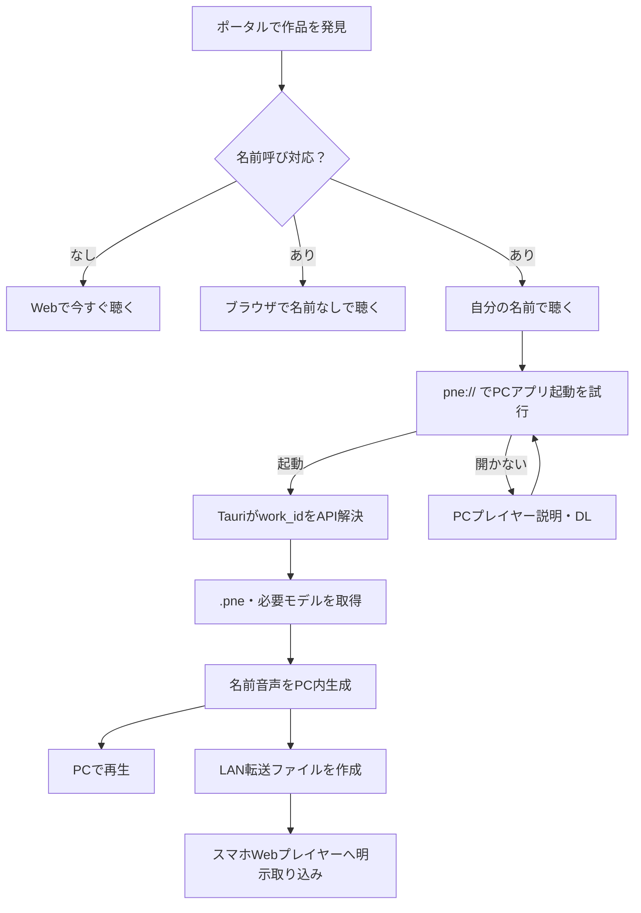
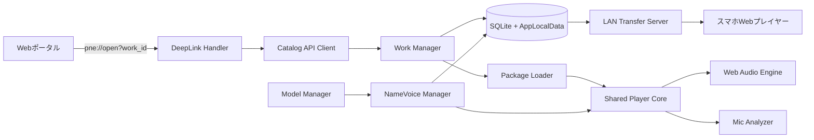
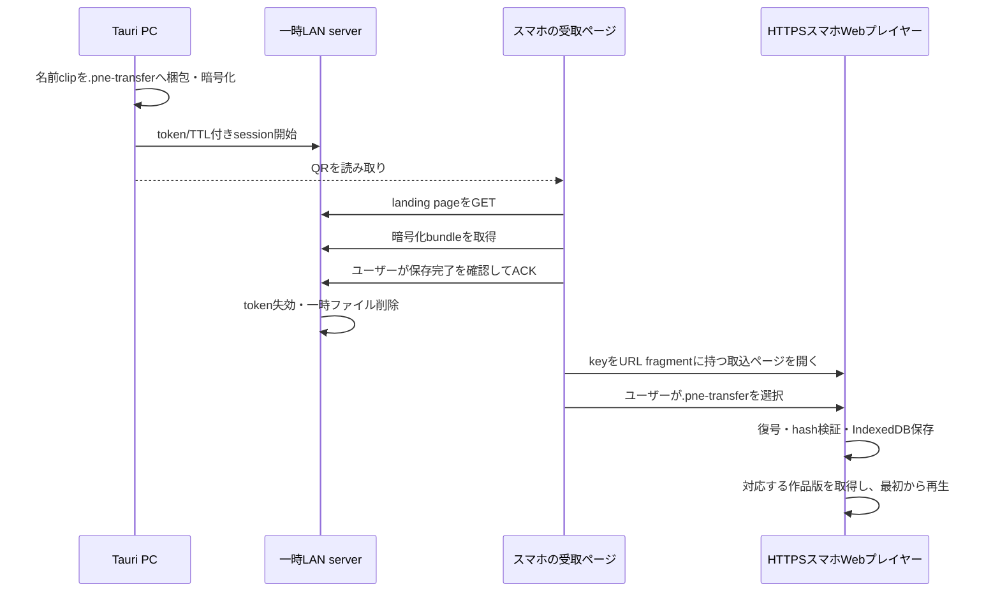

# P.N.E. Tauri PCプレイヤー MVP 実装設計書 v1.0

| 項目 | 内容 |
|---|---|
| 文書状態 | レビュー版（実装設計ベースライン）。§1の`要承認`確定後に実装着手版へ昇格 |
| 作成日 | 2026-08-24 |
| 対象 | P.N.E. ポータル連携、Tauri PCプレイヤー、声優向け収録、スマホへのLAN転送 |
| 対象OS | Windows 11 x64（D-012採用時のMVP候補） |
| 上位文書 | `P.N.E. Webポータル ＋ プレイヤー MVP 要件定義書（草案）.md` |
| 関連資料 | `spec/P.N.E._設計仕様書_v3.0_実装ベース.md`、`spec/P.N.E. 名前音声生成システム 実装設計書 v0.md`、`mock.html`、`pne-name-voice.mjs`、`台本/senpai_script_pack_v02_forced_interpretation.json` |
| 視覚参考 | `po-taru/img/mock2.html` |

---

## 0. 文書の位置づけ

### 0.1 目的

本書は、ポータルで見つけた作品をTauri版で取得し、名前音声をPC内で生成して、PCまたはスマホで再生するまでを、実装・テスト・受入判定ができる粒度で固定する。

上位要件書が「何を作るか」を定義し、本書が次を定義する。

- Webポータル、Tauri、スマホWebプレイヤーの信頼境界
- カスタムプロトコル、HTTPS API、`.pne`、IPCのデータ契約
- 作品・モデル・生成音声・セーブのローカル保存構造
- 名前生成、再生、履歴、Reaction、LAN転送の状態遷移
- 失敗時の復旧動作、セキュリティ、受入条件

本文の「必須」「しなければならない」はMVPの規範要件、「推奨」は実装選択の既定値、「将来」はMVP対象外を表す。

### 0.2 資料の優先順位

プロダクト意図とMVP範囲は上位要件書、実装契約は本書を正本とする。矛盾時は次の順で扱い、上位要件と本書の差異を片方だけ変更して残してはならない。

1. ユーザーが確定した要求、および`po-taru/P.N.E. Webポータル ＋ プレイヤー MVP 要件定義書（草案）.md`
2. 本書
3. `spec/P.N.E._設計仕様書_v3.0_実装ベース.md`
4. 既存HTML・JavaScript試作
5. モック内の表示文言・ハードコード値

本書は、旧草案の「QRに音声ファイルそのものを格納する」記述を廃止し、同一LAN上の一時URLとワンタイムトークンによる転送へ置き換える。上位要件書も同じ境界へ同期済みである。

### 0.3 現在の実装事実

2026-08-24時点では、Tauriプロジェクト、Rustコード、`package.json`、ポータルAPI、`.pne`実ファイルは存在しない。現在あるものは次の試作である。

| 資産 | 現状 | 本書での扱い |
|---|---|---|
| `po-taru/img/mock2.html` | 静的なポータルモック。`work_id`、API、再生、Tauri起動は未配線 | 見た目とコピーの参考。データ契約の正本にはしない |
| `mock.html` | Vanilla JSの分岐プレイヤー試作。名前・読み入力、650ms debounce、生成状態表示、試聴、開始判定、音声sequenceへの差し込みまでをオーケストレーション | Player Core移植元、および名前音声の旧UI・旧状態遷移の比較対象 |
| `pne-name-voice.mjs` | `mock.html`から動的importされる名前音声の実体。Irodori-TTS/WebGPU、VAD、WAV生成、IndexedDBキャッシュを実装 | 呼称解決、context生成、VAD切り出し、cacheの移植元 |
| `hakushakufujin_debugger.html` | 条件評価、状態更新、履歴スナップショットの試作 | Player Coreの状態評価ロジックの移植元 |
| 台本JSON群 | 互いに機能差のある複数形式 | 正規`.pne` v1へ変換する入力資料 |

名前音声の実装事実は`mock.html`単体ではなく、`mock.html`（入力・状態・preview・本編差し込み）、`pne-name-voice.mjs`（TTS/VAD/cache）、参照台本JSON（`start_screen.name_voice`、本文placeholder、`audio.sequence[].name_call`）の組で判断する。既存試作はブラウザ用であり、そのままTauri WebViewへ読み込まない。型、スキーマ、プラットフォームアダプタ、セキュリティ境界を設けて移植する。

なお、現ワークスペースでは`mock.html`の`DEFAULT_PACK_URL`がroot直下の`./senpai_script_pack_v02_forced_interpretation.json`を指す一方、fixtureは`台本/`配下にある。これは旧モックの配布パス不整合であり、`.pne`のpack path契約へ引き継がない。手動JSON読込を含む旧モックの動作確認では、fixtureの配布位置を明示する。

---

## 1. MVPで固定する設計判断

| ID | Status | 決定 | MVPの扱い |
|---|---|---|---|
| D-001 | 確定（依頼） | 起動スキームは `pne://` | `pne://open?work_id=<id>` に統一し、`textpne://` は使用しない |
| D-002 | 確定（依頼） | ポータルから渡す値は `work_id` のみ | 名前、読み、作品URL、パックURL、認証情報、ファイルパスを渡さない |
| D-003 | 技術制約 | ブラウザはアプリ導入済みを確実には判定しない | 起動を試し、同じ画面に常時「開かない場合」の説明・DL導線を出す |
| D-004 | 確定（依頼） | QRは転送データを保持しない | 同一LAN用の一時URLとワンタイムトークンだけを最低限の確定要件とする |
| D-005 | 要承認 | 転送を暗号化fileの二段階取り込みにする | QR fragmentへ暗号鍵を追加し、LANから暗号化`.pne-transfer`を保存後、HTTPSのスマホWebプレイヤーでfile選択して読み込む。OS Downloadの手動削除が残る |
| D-006 | 確定（実装）・権利ゲート | TTSランタイムと固定モデルをアプリ同梱 | 約1.3GBの固定fp16モデルをインストーラーへ含め、初回起動時のモデル通信を不要にする。モデル・派生元の再配布条件確認は公開配布前の必須ゲートとする |
| D-007 | 確定（依頼導線） | ポータルからTauriへ進むMVP導線は名前対応作品だけ | 名前非対応作品はWeb再生を使う。Player Coreの名前なし再生能力はfallbackと将来拡張のため維持する |
| D-008 | 実装必須 | 名前対応作品のWeb再生は名前なし | 各名前スロットに必須のフォールバック音声・表示文を使用する |
| D-009 | 要承認 | Reactionはマイクとボタンを実装 | マイク拒否・喪失時もボタン入力とタイムアウトで必ず進行する |
| D-010 | 要承認 | セーブは作品バージョンへ固定 | 更新後も継続セーブがある旧版を保持し、無断移行しない |
| D-011 | 要承認 | ローカル作品を遠隔削除しない | 非公開化後は新規DL・更新を止めるが、取得済みデータはユーザー操作なしに削除しない |
| D-012 | 要承認 | Windows 11 x64を正式対象にする | macOS、Linux、ARM64はMVP対象外。構造上は後からアダプタ追加可能にする |
| D-013 | 要承認 | CPU TTSフォールバックは持たない | WebGPU不可時は原因を表示し、名前なし再生を選べるようにする |
| D-014 | 要承認・権利ゲート | zero-shot用reference素材を作品へ配布する | 抽出可能であることを含む明示的な再配布・名前slot生成許諾が得られたvoiceだけを扱う |
| D-015 | 要承認 | スマホ転送は名前clipだけを渡し、スマホでは最初から再生する | PCのセーブ・現在位置・作品varsは転送しない。続きから再生はMVP対象外 |
| D-016 | 確定（依頼） | 声優のアフレコ収録はTauri版を必須にする | Web・スマホ録音はMVP対象外。Tauriはローカル録音、再生、録り直し、提出、未同期テイク保持を担う |

`要承認`を残したままschema/API/DBをproduction契約として凍結しない。承認時はStatusを`確定`へ変え、日付・決定者・根拠を改訂メモへ残す。

§2以降はDecision Tableの提案をすべて採用した場合の実装baselineである。`要承認`項目に依存する本文・受入条件は条件付き規範であり、Phase 0のspike以外へ着手する前に承認を完了する。

### 1.1 MVPに含むもの

- ポータルからのカスタムプロトコル起動
- 匿名HTTPS APIによる公開作品情報の解決
- `.pne`のDL、再開、検証、展開、更新、修復、削除
- ローカル作品一覧、オフライン再生
- Irodori-TTSモデル管理と名前音声の一括・個別生成（配布方式はD-006）
- 試聴、個別再生成、キャッシュ削除
- 共通Player CoreによるPC再生、Reaction、履歴再生、セーブ・再開
- 声優向けアフレコ収録モード（案件同期、マイク設定、セリフ単位の録音、ローカル保存、テイク提出）
- マイク診断とボタンフォールバック（D-009採用時）
- 一時LANサーバー、QR、暗号化`.pne-transfer`、スマホWeb取り込み（詳細方式はD-005/D-015）
- 保存容量、モデル、ログ、キャッシュの設定・診断
- アプリ更新機構と署名済み配布物の検証

### 1.2 MVPに含めないもの

- アプリ内ログイン、購入、DRM、課金
- 作者向けプレビュー用deep link、任意ローカル`.pne`のサイドロード
- クラウドセーブ、クラウド名前プロフィール、生成音声のサーバー保存
- スマホへの完全自動取り込み、WebRTC転送、Bluetooth転送
- スマホアプリ、オフラインPWAの恒久インストール
- CPU推論（D-013採用時）、クラウドTTS、再生中のオンデマンドTTS
- 波形編集、イントネーション手修正、AI音声認識
- ブラウザまたはスマホだけでのアフレコ収録
- リアルタイム通話・同時収録・本格DAW編集

---

## 2. プロダクト境界と導線

### 2.1 コンポーネント責務

| コンポーネント | 所有するもの | 所有しない／受け取らないもの |
|---|---|---|
| Webポータル | 作品発見、詳細、作者・声優、コメント、PC版説明、公開作品API、アフレコ制作管理、テイク確認・承認 | 名前、読み、生成音声、PCセーブ、マイク入力 |
| Webプレイヤー | 名前なし再生、スマホ側の転送ファイル取り込み、ブラウザローカル再生状態 | TTS生成、PCファイル管理、LANサーバー |
| Tauri Rust Core | deep link、API、DL、検証、ローカルファイル、DB、セーブ、LANサーバー、診断、収録テイクのローカル保存・同期キュー | DOM表示、物語解釈 |
| Tauri WebView | UI、Player Core、Web Audio、MicAnalyzer、IrodoriAdapter、収録UI・録音制御 | 任意ファイルシステム、任意HTTP、シェル実行 |
| スマホ | ユーザー操作で受け取った名前音声と一時再生データ | P.N.E.サーバーへの名前・生成音声アップロード |

プライバシー原則は次の文言に統一する。

> 名前・読み・生成音声をP.N.E.のサーバーまたは第三者サービスへ送信しない。ユーザーの明示操作による同一LAN内のPC–スマホ直接転送だけを許可する。

### 2.2 基本導線



### 2.3 作品能力フラグ

ポータルモックの `ready | name` という排他的な種別は使用しない。作品能力は独立フラグにする。

```ts
interface WorkCapabilities {
  web_playable: boolean;
  desktop_playable: boolean;
  name_call_supported: boolean;
  mobile_transfer_supported: boolean;
}
```

名前対応作品でも `web_playable=true` にできる。その場合、名前スロットはフォールバック音声に置換される。

### 2.4 作品詳細のCTA

| 条件 | 表示するCTA |
|---|---|
| 名前非対応、Web再生可 | `ブラウザで今すぐ聴く` |
| 名前対応、Web再生可 | `ブラウザで名前なしで聴く` と `自分の名前で聴く` |
| 名前対応、Web再生不可 | `自分の名前で聴く`。Web非対応理由を併記 |
| PC以外から `自分の名前で聴く` | PCが必要な理由、PC版説明ページ、URLを後で開く手段を表示 |

作品詳細は共有可能な `/works/<work_id>` URLを持たせる。モーダル表示を維持する場合もHistory APIでURLを同期する。

名前非対応作品にはMVPでTauri CTAを出さない。`desktop_playable`は名前対応作品のPC再生可否、および将来のオフラインPC導線用の能力値であり、MVPの名前非対応作品導線には使用しない。

### 2.5 PCプレイヤー説明・DLページ

導入前に対応OS、installer署名、必要空き容量、プライバシー、uninstall時の保存データ扱いを表示する。D-006/D-013を採用する場合は、インストーラーに約1.3GBのモデルを含むため必要空き容量が増えること、WebGPU対応GPUが必要なこと、CPUだけでは名前生成できず名前なし再生へfallbackすることをDL CTAの近くへ明記する。`インストール済みか確認中`のような確定判定表示はしない。

---

## 3. 技術構成

### 3.1 対象環境baseline（D-012採用時）

| 項目 | MVP |
|---|---|
| PC OS | Windows 11 x64、サポート中ビルド |
| WebView | Evergreen WebView2。インストーラーで存在確認し、不足時は公式ランタイム導入へ案内 |
| GPU | `navigator.gpu` とIrodoriモデルの初期化に成功するWebGPUアダプタ |
| スマホ受取 | サポート中のAndroid Chrome、iOS Safari。ファイル選択、WebCrypto、IndexedDBが使えること |
| ネットワーク | 作品・モデル取得はHTTPS。同一LAN転送はPrivateネットワーク上のIPv4 |

Windows 10、macOS、Linux、ARM64は動作を妨げないが、MVP受入試験とサポートの対象外とする。

### 3.2 実装スタック

| 層 | 採用 |
|---|---|
| Desktop shell | Tauri 2系の実装開始時点で最新のsecurity-patched releaseをexact pin。major 3へ自動更新しない |
| Rust | stable、Tauri 2が要求するMSRV以上 |
| UI | TypeScript、React、Vite |
| 共通Player | フレームワーク非依存TypeScript core + React UI |
| 永続化 | SQLite（Rust管理、WAL）、ローカルファイル |
| HTTP client | Rust `reqwest` + rustls、ストリーミングDL |
| ZIP | Rust `zip`。ZIP64、UTF-8ファイル名 |
| Hash | SHA-256 |
| 一時LAN server | Rust `axum`/`tokio`、1セッション限定 |
| 転送暗号 | AES-256-GCM。鍵はQR URL fragmentに格納 |
| TTS | 既存Irodori-TTS WebGPUアダプタ、ONNX Runtime Web |
| TTS実行thread | Dedicated Web Worker。model byteをmain UI threadへ渡さない |
| QR描画 | フロントエンドでローカル生成。外部QRサービスは禁止 |

依存バージョンはlockfileへ固定する。本書に記載したメジャーバージョンを勝手に上げない。

### 3.3 アーキテクチャ



### 3.4 モジュール責務

| モジュール | 責務 |
|---|---|
| `LaunchCoordinator` | cold/warm deep link、通常起動、重複抑止、再生中の切替確認 |
| `CatalogClient` | `work_id`から公開リリースを取得。APIホスト以外を信用しない |
| `WorkManager` | DL、再開、検証、staging展開、原子的切替、修復、削除 |
| `PackageLoader` | `.pne` schema、参照、feature、asset URLを検証 |
| `ModelManager` | 必要モデルの取得、hash検証、共有キャッシュ、容量管理 |
| `NameVoiceManager` | 必要リクエスト抽出、一括・個別生成、試聴、キャッシュ |
| `RuntimeStore` | 再生セッションの唯一のSource of Truth |
| `NarrativeController` | ノード遷移、条件、状態更新、Reaction分岐 |
| `AudioEngine` | VOICE/BGM/SE/名前クリップを再生。物語遷移は決めない |
| `MicAnalyzer` | RMSから`VOICE/SILENT/UNKNOWN`を返す。意味解釈しない |
| `HistoryController` | 実際に通った経路、履歴再生、live head復帰 |
| `SessionRepository` | バージョン固定セーブ、復元、削除 |
| `TransferManager` | 暗号化転送パック、一時サーバー、token/TTL/ACK、後始末 |
| `Diagnostics` | 機密情報を除いたログ、容量、GPU、マイク、ネットワーク状態 |

### 3.5 推奨ワークスペース構造

```text
apps/
  portal/                    WebポータルとWebプレイヤー
  desktop/                   Tauri UI
    src/
    src-tauri/
      src/
        launch/
        catalog/
        works/
        models/
        persistence/
        transfer/
        diagnostics/
      capabilities/
packages/
  pne-schema/                JSON Schema、生成型、validator
  player-core/               決定論的Runtime
  player-ui/                 共通React UI
  name-voice/                IrodoriAdapter、VAD、生成制御
  test-fixtures/             Golden .pneと不正パック
```

既存試作は削除せず、移植完了までGolden behaviorの比較元として残す。

---

## 4. ポータル連携・deep link

### 4.1 URL契約

正式URLは次だけとする。

```text
pne://open?work_id=rain_room
```

検証規則は次の通り。

- schemeは完全一致で `pne`
- hostは完全一致で `open`
- pathは空または `/`
- queryは `work_id` を1個だけ持つ
- user info、port、fragment、追加queryを拒否
- percent decode後の `work_id` は1〜128 byte
- `work_id` は `^[A-Za-z0-9][A-Za-z0-9._-]{0,127}$`
- タイトルや作者名などの意味をID文字列から推測しない

`work_id`はURL segmentへRFC 3986に従ってpercent encodeする。ファイル名には直接使わず、`work_key = lowercase_hex(SHA-256(UTF-8(work_id)))`を保存directory keyにする。

カスタムURLは任意のローカルプロセスから偽装できる。受信値は常にuntrusted inputとして扱い、APIから公開状態と正規メタデータを引き直す。

### 4.2 ポータル側の起動UX

`自分の名前で聴く` はユーザーのclick/tap内でdeep linkを開く。同じ画面に次を常時表示する。

- `PCプレイヤーを開く`
- `開かない場合：PCプレイヤーをダウンロード`
- 対応OS
- インストール後はこの作品ページへ戻り、もう一度押す説明

タイマーや`document.visibilityState`は「起動した可能性」の表示補助には使えるが、導入済み判定、成功イベント、DLページへの強制リダイレクトには使わない。

### 4.3 Tauri側の受信

Tauri 2のdeep-link pluginを静的scheme `pne` で構成し、single-instance pluginを最初に登録する。

- cold startは初期URLをRust側で取得し、UI readyまでキューする
- warm startは既存ウィンドウへイベントを渡し、最小化解除・前面化する
- 同じ`work_id`の2秒以内の重複イベントは捨てる
- 再生中に別作品を受けた場合は「現在の再生を中断して開く」を確認する
- 確認前に現在セッション、音声、生成ジョブを変更しない
- キューは最大1件。後着イベントで置換し、画面に対象作品を表示する

状態遷移は次とする。

```text
RECEIVED
  -> VALIDATING
  -> RESOLVING_API
  -> LOCAL_READY | DOWNLOAD_REQUIRED | UPDATE_REQUIRED
  -> WORK_READY
  -> NAME_SETUP

任意状態 -> INVALID_LINK | NOT_FOUND | UNPUBLISHED | WEB_ONLY_WORK | OFFLINE_NO_LOCAL | APP_UPDATE_REQUIRED
```

APIで`name_call_supported=false`の作品を手作りdeep linkで受けた場合はDesktop packを取得せず、`この作品はブラウザで聴けます`と作品Web URLへの限定`portal_open`を表示する。名前なしPlayer Coreは名前対応作品の生成失敗fallbackとスマホ/Web共通化に使うもので、名前非対応作品のTauri導線をMVPへ追加しない。

### 4.4 公開作品API

MVPの再生はアカウント不要とし、次を匿名GETで提供する。

```http
GET /api/v1/desktop/works/{work_id}
Accept: application/json
If-None-Match: "..."
```

レスポンス例：

```json
{
  "api_schema_version": "1.0",
  "work_id": "rain_room",
  "status": "published",
  "title": "雨の部屋",
  "author": { "id": "author_01", "name": "作者名" },
  "cover": {
    "url": "https://cdn.example.invalid/works/rain_room/cover.webp",
    "bytes": 184221,
    "sha256": "64 lowercase hex characters"
  },
  "capabilities": {
    "web_playable": true,
    "desktop_playable": true,
    "name_call_supported": true,
    "mobile_transfer_supported": true
  },
  "release": {
    "release_id": "rel_rain_room_1_2_0",
    "work_version": "1.2.0",
    "content_graph_hash": "64 lowercase hex characters",
    "pack_format_version": "1.0.0",
    "min_desktop_version": "1.0.0",
    "published_at": "2026-08-24T00:00:00Z",
    "pack": {
      "url": "https://cdn.example.invalid/works/rain_room/1.2.0.pne",
      "bytes": 482344921,
      "unpacked_bytes": 528122004,
      "sha256": "64 lowercase hex characters",
      "etag": "opaque release etag"
    },
    "models": [
      {
        "model_id": "irodori-tts-500m-v3-fp16",
        "model_version": "b75a9bbf2c10",
        "manifest_url": "https://cdn.example.invalid/models/irodori/b75a9bbf2c10/manifest.json",
        "manifest_sha256": "64 lowercase hex characters"
      }
    ],
    "voice_authorizations": [
      {
        "authorization_id": "va_hiiro_name_slots_v1",
        "voice_id": "hiiro",
        "scope": "name_slots_only",
        "distribution_mode": "reference_audio",
        "reference_asset_sha256": ["64 lowercase hex characters"],
        "payload": "base64url canonical authorization payload",
        "signature": "base64url Ed25519 signature"
      }
    ]
  }
}
```

APIの`work_id / release_id / work_version / content_graph_hash`とパック内の各値は完全一致しなければならない。APIとpackのcapabilities、required model集合、各voice profileのmodel ID/versionも完全一致を必須とし、不一致は`RELEASE_METADATA_MISMATCH`で拒否する。URLはHTTPSかつビルド設定の許可ホストだけを認め、redirect後も再検証する。coverはRust側が取得・hash検証してcatalog asset cacheへ置き、WebViewからremote URLを直接読み込まない。

`release_id`、`work_id + work_version`、pack hash、model versionは公開後immutableとする。同じversionのファイル差し替えを禁止し、修正は必ず新しいversion/releaseとして公開する。API cacheがない状態で`304`を受けた場合は、validatorなしのGETを一度だけやり直す。

| HTTP | アプリ動作 |
|---|---|
| `200` | メタデータを検証し、ローカル版と比較 |
| `304` | キャッシュ済みAPIメタデータを使用 |
| `404` | `作品が見つかりません` |
| `410` | `現在は公開されていません`。ローカル版があればオフライン再生可 |
| `426`相当または`min_desktop_version`超過 | アプリ更新を必須表示 |
| timeout/5xx/offline | ローカルready版があれば開く。なければ再試行 |

作者プレビュー、下書き、署名付き期限URLはこのAPIへ混在させない。

スマホ転送前のexact-version確認には次を使う。

```http
GET /api/v1/web/works/{work_id}/releases/{work_version}
Accept: application/json
```

`200`はWeb player用releaseの`work_id / release_id / work_version / content_graph_hash / web_manifest URL / web_manifest SHA-256`を返す。Web配信用assetはDesktop `.pne`とは別の派生物でよく、desktop pack SHAとの一致は要求しない。両者が同じシナリオ・slot IDを持つことを`release_id + content_graph_hash`で照合する。Web releaseのformat、asset quotaはWebプレイヤー仕様の正本で定義し、API/CDNのCORSは正式`PLAYER_ORIGIN`だけを許可する。

`404`または`410`なら、そのPC作品版はスマホ転送不可とする。Tauriは転送前にこのAPIを確認し、旧セーブや旧版を変更せず、`この版はスマホへ転送できません。PCで聴くか、最新版を最初から準備してください`と表示する。名前、生成音声、セーブ状態はrequestへ含めない。

旧Desktop版の修復には次のimmutable endpointを使う。

```http
GET /api/v1/desktop/works/{work_id}/releases/{work_version}
```

まずローカル保存済み`package.pne`から再展開を試し、archive自体が壊れている場合だけexact releaseを再取得する。superseded Desktop releaseは最低24か月保持する。保持期間終了後に再取得不能でも既存セーブを削除せず、ローカルarchiveが修復不能であることを表示する。

### 4.5 Web release最小契約

exact Web release APIの`200` bodyは次を必須とする。

```json
{
  "api_schema_version": "1.0",
  "work_id": "rain_room",
  "status": "published",
  "release_id": "rel_rain_room_1_2_0",
  "work_version": "1.2.0",
  "content_graph_hash": "64 lowercase hex characters",
  "web_manifest": {
    "url": "https://cdn.example.invalid/web/rain_room/1.2.0/manifest.json",
    "bytes": 42000,
    "sha256": "64 lowercase hex characters",
    "etag": "strong immutable etag"
  }
}
```

Web manifestのMVP正規形：

```json
{
  "format": "pne-web-release",
  "format_version": "1.0.0",
  "work_id": "rain_room",
  "release_id": "rel_rain_room_1_2_0",
  "work_version": "1.2.0",
  "content_graph_hash": "64 lowercase hex characters",
  "min_player_version": "1.0.0",
  "runtime_state_schema": {
    "version": "1.0",
    "variables": {}
  },
  "name_slots": [
    {
      "slot_id": "name.start.whisper",
      "fallback_clip_id": "voice.start.no_name",
      "fallback_text": "あなた",
      "pre_gap_ms": 0,
      "post_gap_ms": 40,
      "crossfade_ms": 5
    }
  ],
  "scenario": {
    "url": "https://cdn.example.invalid/web/rain_room/1.2.0/scenario.json",
    "bytes": 184000,
    "sha256": "64 lowercase hex characters"
  },
  "assets": [
    {
      "asset_id": "voice.start.prefix",
      "kind": "voice",
      "mime": "audio/mpeg",
      "url": "https://cdn.example.invalid/web/rain_room/1.2.0/audio/start-prefix.mp3",
      "bytes": 84000,
      "sha256": "64 lowercase hex characters",
      "duration_ms": 1330
    }
  ]
}
```

- `runtime_state_schema`、`name_slots`の論理field、`scenario.json`はDesktop版と同じschemaを使い、全node/slot/logical asset参照を持つ。Web側だけのURL、codec、byte/hashは`assets[]`へ分離する
- node/slot/asset IDは各namespaceで一意とし、scenarioとfallbackが参照する全asset/slotがmanifest内に存在し、未参照のgenerated slot overrideを受理しない
- manifest 1MiB、scenario 10MiB、asset 20,000件、単一asset 512MiB、宣言合計2GiBを上限とする。スマホは全assetを一括保存せず再生に必要なassetをHTTPSで逐次取得する
- manifest/scenario/assetは公開後immutableで、URL redirect後も`CDN_ALLOWLIST`、HTTPS、size、SHA-256を検証する。Web playerのfetchは`credentials: "omit"`とし、CORSは`PLAYER_ORIGIN`だけ、`Cache-Control`はversion URLへ`public, max-age=31536000, immutable`
- importしたclipの`slot_ids`だけを`name_slots[].slot_id`へoverrideし、不足slotはfallback clip/textを使う。Web manifestへ名前、cache key、PC sessionを加えない
- exact releaseが`404/410`、hash不一致、player version非対応ならimportをcommitせず`WEB_RELEASE_UNAVAILABLE`とし、PC側の旧sessionやclipは変更しない

### 4.6 `content_graph_hash`算出

Desktop/Web共通のauthoring出力から次のprojectionを作る。

```json
{
  "graph_schema_version": "1.0",
  "runtime_state_schema": { "version": "1.0", "variables": {} },
  "name_slots": [],
  "scenario": {
    "schema_version": "1.0",
    "entry_node": "END",
    "nodes": [{ "id": "END", "type": "end", "timeline_ms": 0 }]
  }
}
```

Desktopの各name slotは`slot_id / fallback_clip_id / fallback_text / pre_gap_ms / post_gap_ms / crossfade_ms`だけへprojectし、Webの`name_slots`と同形にする。算出前に`name_slots`を`slot_id`昇順、`scenario.nodes`を`id`昇順へ並べる。display/audio sequence、`branch.variants`、effectsなど意味を持つ配列順は維持する。URL、codec、物理path、asset byte/hash、title/author、voice/form/style、model/reference/authorizationはprojectionへ含めない。数値はschemaでintegerまたは有限numberに制限し、projectionをRFC 8785 JCSでUTF-8化したbyte列のSHA-256 lowercase hexを`content_graph_hash`とする。

Publisherはplatform package作成前に一度算出しAPI、Desktop manifest、Web manifestへ埋める。Desktop validatorとWeb playerは受信JSONから独立に再計算し、自己申告hashだけを比較しない。このhashは「同じ物語graph・state・名前slot契約」を保証するもので、Desktop/Webの物理音声byte同一性は各release manifestのasset SHA-256が個別に保証する。

---

## 5. `.pne`作品取得・ローカル管理

### 5.1 コンテナ仕様

`.pne` v1はZIP64コンテナとする。

| 項目 | 値 |
|---|---|
| 拡張子 | `.pne` |
| MIME | `application/vnd.pne.package+zip` |
| 文字コード | JSON、ファイル名ともUTF-8 |
| 必須ファイル | `manifest.json`、`scenario.json`、`assets.json` |
| パック内容 | 宣言済みJSON、音声、画像のみ |
| 禁止 | HTML、JavaScript、WASM、実行形式、symlink、hardlink、絶対パス、`..` |

標準構造：

```text
work.pne
  manifest.json
  scenario.json
  assets.json
  audio/
    voice/
    bgm/
    se/
    reference/
  image/
    cover.webp
```

音声ファイルは再圧縮せずstore、JSONはdeflateを推奨する。パック内ファイルの大文字小文字だけが異なる重複を禁止する。

### 5.2 `manifest.json`

```json
{
  "format": "pne",
  "format_version": "1.0.0",
  "work_id": "rain_room",
  "release_id": "rel_rain_room_1_2_0",
  "work_version": "1.2.0",
  "content_graph_hash": "64 lowercase hex characters",
  "title": "雨の部屋",
  "entry_node": "START",
  "timeline_duration_ms": 1800000,
  "runtime_state_schema": {
    "version": "1.0",
    "variables": {
      "relationship.affection": {
        "type": "integer",
        "initial": 0,
        "minimum": -10,
        "maximum": 10
      }
    }
  },
  "scenario_path": "scenario.json",
  "assets_path": "assets.json",
  "required_features": ["reaction.v1", "history.v1", "name_voice.v1"],
  "capabilities": {
    "web_playable": true,
    "desktop_playable": true,
    "name_call_supported": true,
    "mobile_transfer_supported": true
  },
  "name_voice": {
    "preview_slot_id": "name.start.whisper",
    "required_models": [
      {
        "model_id": "irodori-tts-500m-v3-fp16",
        "model_version": "b75a9bbf2c10"
      }
    ],
    "voice_profiles": [
      {
        "voice_id": "hiiro",
        "model_id": "irodori-tts-500m-v3-fp16",
        "model_version": "b75a9bbf2c10",
        "references": {
          "neutral": "ref.hiiro.neutral",
          "whisper": "ref.hiiro.whisper"
        },
        "authorization_id": "va_hiiro_name_slots_v1"
      },
      {
        "voice_id": "char_ren",
        "model_id": "irodori-tts-500m-v3-fp16",
        "model_version": "b75a9bbf2c10",
        "references": {
          "neutral": "ref.ren.neutral"
        },
        "authorization_id": "va_ren_name_slots_v1"
      }
    ],
    "slots": [
      {
        "slot_id": "name.start.whisper",
        "voice_id": "hiiro",
        "form": "profile",
        "style": "whisper",
        "fallback_clip_id": "voice.start.no_name",
        "fallback_text": "あなた",
        "pre_gap_ms": 0,
        "post_gap_ms": 40,
        "crossfade_ms": 5
      },
      {
        "slot_id": "name.ren",
        "voice_id": "char_ren",
        "form": "profile",
        "style": "neutral",
        "fallback_clip_id": "voice.ren.name.no_name",
        "fallback_text": "あなた",
        "pre_gap_ms": 0,
        "post_gap_ms": 40,
        "crossfade_ms": 5
      }
    ]
  }
}
```

規則：

- `format_version`はSemVer。MVPはmajor `1`だけを受理する
- v1 schemaは`additionalProperties: false`を既定とし、unknown field、重複JSON key、unknown `required_features`を拒否する。field追加はschema minorと生成DTOを更新してから受理する
- `work_id`、`work_version`はAPIレスポンスと一致必須
- `slot_id`、`voice_id`、`asset_id`、`node_id`は各namespace内で一意
- packの自己申告を許諾証跡にしない。`authorization_id`をAPIの署名済みvoice authorizationへ照合し、voice ID、scope、reference SHA-256、distribution modeが一致しなければ拒否する
- 全名前スロットは`fallback_clip_id`と`fallback_text`を必須とする
- `slots[].voice_id`は`voice_profiles[].voice_id`へ解決できる。複数キャラクター作品では、キャラクターごとに別の`voice_id`を定義し、同じIrodoriモデルを共有する
- `slots[].form`は`profile`または固定呼称。固定呼称をユーザーの既定呼称へ置換しない
- `preview_slot_id`を指定する場合は`slots[].slot_id`に存在し、`voice_id`・`form`・`style`が解決可能でなければならない。未指定時は全clip rowの個別試聴だけを提供し、成功した別slotを暗黙にpreviewへ置き換えない
- パック内にモデルURLを記載しない。モデル配布先は正規APIだけが返す

`distribution_mode=reference_audio`は、reference WAVが一般ユーザーのPCへ配布・展開され抽出可能であることを意味する。権利者がそのリスクを明示承認していないvoiceは公開してはならない。speaker embedding等へ変更できる場合は新しいdistribution modeとTTS adapter versionを定義し、既存modeと暗黙互換にしない。

### 5.3 `assets.json`

```json
{
  "schema_version": "1.0",
  "assets": [
    {
      "asset_id": "voice.start.prefix",
      "path": "audio/voice/start_prefix.wav",
      "kind": "voice",
      "mime": "audio/wav",
      "bytes": 132004,
      "sha256": "64 lowercase hex characters",
      "duration_ms": 1330
    },
    {
      "asset_id": "ref.hiiro.whisper",
      "path": "audio/reference/hiiro_whisper.wav",
      "kind": "voice_reference",
      "mime": "audio/wav",
      "bytes": 486012,
      "sha256": "64 lowercase hex characters",
      "duration_ms": 5200
    }
  ]
}
```

MVPで受理するメディアは次とする。

| 種別 | 必須対応 |
|---|---|
| 名前差し込み前後・参照音声 | WAV、PCM 16-bit、mono、48kHz |
| 通常VOICE/SE | WAVまたはMP3、44.1/48kHz |
| BGM | MP3、44.1/48kHz |
| 画像 | PNG、JPEG、WebP |

既存OGG素材はパック作成時に上記形式へ変換する。ランタイムがOS固有codec対応へ依存しないようにする。

### 5.4 `scenario.json`

Player Coreが参照する正規形だけを格納する。音声差し込みは本文から推測せず、`name_slot_id`で明示する。

```json
{
  "schema_version": "1.0",
  "entry_node": "START",
  "nodes": [
    {
      "id": "START",
      "type": "reaction_prompt",
      "timeline_ms": 0,
      "speaker": "蒼汰",
      "display_sequence": [
        { "text": "……" },
        { "name_slot_id": "name.start.whisper" },
        { "text": "先輩、で合ってます？" }
      ],
      "audio": {
        "sequence": [
          { "clip_id": "voice.start.prefix" },
          { "name_slot_id": "name.start.whisper" },
          { "clip_id": "voice.start.suffix" }
        ]
      },
      "reaction_window": {
        "window_ms": 4000,
        "accepted_raw_inputs": ["VOICE", "SILENT", "NEXT"],
        "timeout_input": "SILENT",
        "context_mapping": {
          "VOICE": "CONFIRM_NAME",
          "SILENT": "ACCEPT_WITHOUT_CORRECTION",
          "NEXT": "CONFIRM_NAME",
          "UNKNOWN": "ACCEPT_WITHOUT_CORRECTION"
        },
        "branches": {
          "CONFIRM_NAME": "START_VOICE",
          "ACCEPT_WITHOUT_CORRECTION": "START_SILENT"
        }
      }
    }
  ]
}
```

表示と音声の名前位置はいずれも同じ`name_slot_id`で明示し、文字列中の`{{name}}`から推測しない。Tauriではslotを表示名へ、名前なしWebではslotの`fallback_text`へ解決する。名前clipを取り込んだスマホは本文に個人名を表示せずfallback textを使う。schema validatorは参照・個数を機械検査し、台詞上の意味整合はauthoring warningと公開審査で確認する。Reactionは`ReactionInput -> context_mappingでContextAction -> branchesでnode ID`の二段階とし、ReactionInputからnodeへ直接分岐しない。`UNKNOWN`を含む全到達ReactionInputにmappingを必須とする。

MVPで受理するnode typeは次に閉じる。unknown typeは`INCOMPATIBLE`であり、近いtypeへ推測変換しない。

| type | 必須field | 動作 |
|---|---|---|
| `line` | `id, timeline_ms, display_sequence, audio.sequence, advance, next` | 表示・音声を1回再生。`advance=auto`は次へ、`user_next`は手動NEXT待ち |
| `reaction_prompt` | `id, timeline_ms, display_sequence, audio.sequence, reaction_window` | prompt完了後に1回だけ入力を解決し、Context Actionのbranchへ進む |
| `branch` | `id, timeline_ms, variants[], default_next` | 上から条件評価し最初のtrueへ進む。音声を持たない |
| `effect` | `id, timeline_ms, effects[], next` | 宣言effectだけをcommitして次へ進む |
| `sleep_loop` | `id, timeline_ms, audio.sequence, exit_after_ms, next` | Reactionを開かず、宣言時間だけloopして次へ進む |
| `end` | `id, timeline_ms` | ENDへ遷移する |

`branch.variants[]`は一意な`variant_id`、構造化`when`、`next`を持つ。条件は`all / any / not / eq / neq / lt / lte / gt / gte`と`{ "var": "namespace.key" }`、JSON primitiveの`{ "const": ... }`だけを許可し、文字列式を実行しない。effectは`set`、数値`add`、数値`clamp`、`narrative_state`（`NORMAL/PASSIVE`）、`visual_state`、BGMの`start/stop/set_gain`だけを許可する。変数path・型・初期値・数値範囲はmanifestの`runtime_state_schema.variables`へ事前宣言し、未知path・型変更・範囲外・NaN/Infinity・prototype keyを拒否する。`PASSIVE`中は`reaction_prompt`へ到達してはならず、先に`narrative_state=NORMAL` effectを通す。`timeline_ms`は0〜`manifest.timeline_duration_ms`で、全edge上で非減少とし、履歴UI上の全体位置だけに使用して条件や再生時間を決めない。自動遷移はユーザー入力またはaudio待ちなしで連続1000 nodeを超えたら`RUNTIME_LOOP_GUARD`で安全停止する。

`visual_state` effectは`{ target: "VISIBLE" | "BLACKOUT", duration_ms: 0..5000, se_asset_id?: string }`で、`BLACKOUT`への遷移中だけRuntime表示を`DIMMING`にする。解除も`target=VISIBLE`で明示し、履歴entryには遷移後stateを保存する。`sleep_loop`は開始時`SLEEP_LOOP`へ入り、必須`exit_state: "NORMAL" | "PASSIVE"`へ戻ってから`next`へ進む。

Reaction Loopは任意cycleではなく、連続する`reaction_prompt`の`reaction_window.loop = { loop_id, turn, max_turns }`で表す。`max_turns`は1〜3、`turn`は1から単調増加し、branch後の経路は同じloopの次turnまたはloop外のexitへ有限node数で到達しなければならない。後退edge、同じturnへのedge、最終turnから同loopへのedgeをvalidatorが拒否する。これによりマイク不許可・全`UNKNOWN`でも必ず有限回で本筋へ戻る。

RuntimeのNarrativeStateはnodeから決定論的に導く。`advance=user_next`のline完了後は`WAIT_USER_NEXT`、loopなしreaction promptは`WAIT_REACTION`、loop付きは`REACTION_LOOP`、sleep nodeは`SLEEP_LOOP`、endは`END`とし、それ以外はcheckpointの`NORMAL/PASSIVE`を使う。packが任意文字列でstateを直接注入することはできない。

```json
{
  "id": "BRANCH_AFFECTION",
  "type": "branch",
  "timeline_ms": 640000,
  "variants": [
    {
      "variant_id": "HIGH",
      "when": { "gte": [{ "var": "relationship.affection" }, { "const": 3 }] },
      "next": "LINE_HIGH"
    }
  ],
  "default_next": "LINE_NORMAL"
}
```

### 5.5 パック安全制限

| 制限 | MVP既定値 |
|---|---|
| 圧縮後パック | 2 GiB以下 |
| 展開後合計 | 4 GiB以下 |
| entry数 | 20,000以下 |
| 単一ファイル | 512 MiB以下 |
| 単一JSON | 10 MiB以下 |
| パス長 | UTF-8で240 byte以下 |
| 圧縮率 | entryごと200:1以下 |

API値、ZIP central directory、実際の展開byte数のすべてで制限する。正規化後のpath traversal、予約デバイス名、末尾dot/space、NUL、symlink、重複pathを拒否する。JSONはnest深度64、単一配列100,000要素以下とし、duplicate keyをparse時に拒否する。作品テキストはHTMLとして描画せず、Reactのtext nodeとして扱う。

### 5.6 DL・インストール

```text
NOT_INSTALLED
  -> DOWNLOADING
  -> VERIFYING_ARCHIVE
  -> VALIDATING_SCHEMA
  -> EXTRACTING_STAGING
  -> VERIFYING_ASSETS
  -> READY

任意の検証失敗 -> CORRUPT
対応外schema/feature -> INCOMPATIBLE
新リリース検出 -> UPDATE_AVAILABLE
```

処理順：

1. API manifestと現在の空き容量を確認
2. `temp/downloads/<task_id>.part`へストリーミングDL
3. 強いETagを保存し、`Range`と`If-Range: <etag>`を送る。serverが同じETagの`206 Partial Content`を返し、`Content-Range`開始位置が`.part`長と一致した場合だけ追記する。それ以外の`200/412/416`、弱いETag、ETag欠落は`.part`を破棄して先頭から取得する
4. 全体SHA-256、byte数を照合
5. ZIPとJSON schemaを展開前検査
6. `works/.staging/<task_id>/`へ安全に展開
7. 全assetのbyte数・SHA-256・参照整合を検査
8. `works/<work_key>/<version_key>/`へ同一volume内rename。`version_key`も`lowercase_hex(SHA-256(UTF-8(work_version)))`とする
9. SQLite transactionで`READY`へ切替
10. `.part`とstagingを削除

必要空き容量は次で判定する。

```text
pack.bytes + pack.unpacked_bytes + max(512 MiB, unpacked_bytes * 10%)
```

更新時は旧版保持分も加算する。DL中にアプリが終了しても`.part`だけを再利用し、stagingは次回起動時に削除する。

### 5.7 更新とセーブ互換（D-010採用時）

- 新版は旧版と別directoryへinstallする
- 新規再生はactive versionを使う
- 進行中セーブは`work_id + work_version + pack_sha256`へpinする
- 旧版にセーブがある間は旧版を自動削除しない
- `save_migrations`は将来追加。MVPでは作品版をまたぐ自動移行をしない
- UIは`前回の版で続きから`と`最新版を最初から`を分ける
- 旧版削除時は関連セーブ・名前音声が消えることを明示して確認する

### 5.8 破損・修復・非公開（ローカル保持はD-011採用時）

- 起動時はDB、directory、manifestの軽量整合を確認する
- 再生前に使用assetの存在と記録済みsizeを確認する
- `修復`は全asset SHA-256を再計算し、不一致なら同じリリースを再取得する
- APIで非公開でもローカルready版を無断削除しない
- 非公開作品の新規DL、更新、スマホ用Web pack取得は拒否され得ることを表示する
- DRMや遠隔失効はMVPに実装しない

---

## 6. 名前音声生成・モデル管理

### 6.1 入力プロフィール

Tauriで名前対応作品を開いた場合だけ次を入力する。

| 項目 | 規則 |
|---|---|
| 表示名 | NFC、trim後1〜20 grapheme。制御文字を禁止 |
| 読み | NFKC、trim、カタカナをひらがなへ正規化。1〜40 grapheme |
| 読みの許可文字 | ひらがな、`ー`、`・`、空白 |
| 希望呼称 | `bare / chan / san / kun / senpai` |
| 次回の入力候補として保存 | 既定OFF。ON時だけ別作品でも選べる再利用プロフィールとして暗号化保存 |

slotの`form`が`profile`なら希望呼称を使い、固定値なら作品指定を使う。表示名と読みの違いをプレビューで示す。

既存packの`audio.sequence[].name_call`やslotの固定`form`は作品指定として扱う。静的suffix（例：`先輩`）を含む作品で固定formを`profile`へ置換すると呼称が二重になるため、converterはこの置換を行わない。

姓・姓読みはMVP入力に含めない。`surname` slotを持つ旧資料はconverterで自動置換せず、コンテンツ修復対象としてerrorにする。演技styleは`neutral / soft / whisper / drawl / shout / desperate / question`をschema上のMVP列挙とし、対応referenceとrecipeのないstyleをpack validationで拒否する。

### 6.2 保存とプライバシー

- 名前・読みをログ、ファイル名、イベントpayload、APIへ含めない
- 保存プロフィールはWindows DPAPIで暗号化してSQLiteへ格納する
- セーブに必要なプロフィールsnapshotもDPAPI暗号化する
- 生成ファイル名はSHA-256 cache keyだけにする
- cache照合用profile fingerprintは、DPAPI保護したinstall secretによるHMAC-SHA-256とする
- `名前データを削除`でプロフィール、セーブ内snapshot、生成音声を選択削除できる
- SSD等では物理的な完全消去を保証せず、UI文言は「P.N.E.の保存領域から削除」とする

このoptionがOFFでも、現在作品の続きから再生とcache再利用に必要な暗号化profile snapshotおよび生成WAVはP.N.E.保存領域へ残る。入力画面にこの違いと削除場所を明示する。未完了sessionをユーザーが削除した時点で、他session/slotから参照されていないsnapshotと生成WAVを削除候補にする。

### 6.3 モデル配布（D-006/D-013採用時）

現行実装はモデルrevision `b75a9bbf...`、6 ONNX component、同梱合計1,255,474,038 byteを使用する。モデルはViteの静的assetとしてinstallerへ含め、初回利用時も外部通信なしで読み込む。

- Irodori実行コード、ONNX Runtime、tokenizerはアプリへ同梱
- ONNX model本体（`models/<revision>/onnx_fp16/`のgraph 6個＋external data 6個）もアプリへ同梱
- `pne-name-voice.mjs`は同梱asset URLだけを読み、モデルをCache Storageへ複製しない
- 同梱assetの不足・破損は生成開始時に明示エラーとし、アプリ再インストールを復旧操作にする
- 同じ`model_id + model_version`を全作品で共有
- モデル更新は旧版と並存し、参照中の版を削除しない。更新版は新しいinstallerで配布する
- 再配布ライセンスと音声利用許諾の確認をリリースゲートにする

モデル状態：

```text
PACKAGED -> LOADING -> READY
任意 -> CORRUPT | INCOMPATIBLE
```

model manifestはcomponentごとに固定filename、byte数、SHA-256、MIME、ONNX external-data対応関係を持つ。未知filename、絶対path、redirect先allowlist違反、宣言合計byteが4GiBを超えるものを拒否する。component DLは§5.6と同じ強いETag/`If-Range`契約を使い、cancel済み`.part`は7日だけresume候補として保持する。model versionはimmutableであり、`UPDATE_AVAILABLE`は既存versionの差し替えではなく、別versionを新しい作品またはruntimeが要求した場合だけを表す。

Rust `ModelManager`は検証済みcomponentのasset URLだけを`ModelDescriptor`として返す。`name-voice-worker.ts`がlocal asset URLからONNX graph/external data、同梱WASM、tokenizerを読み込み、推論・VAD・WAV encodeをWorker内で行う。main threadへ返すのは`run_id / slot_id / stage / completed / total`だけのprogress、error code、最大4MiBの完成clipとし、読み、`callReading`、モデルbyte、reference PCMを返さない。既存`pne-name-voice.mjs`のHugging Face固定URL、Cache Storage、main-thread実行、progressへの`callReading`混入はこの境界へ改修する。

```ts
interface AssetLease {
  leaseId: string;
  purpose: "NAME_GENERATION" | "PLAYBACK" | "PREVIEW" | "COVER";
  ownerWebviewGeneration: string;
  renewAfterMs: 30_000;
  expiresWithoutRenewMs: 120_000;
}

interface AssetDescriptor {
  id: string;
  mime: string;
  bytes: number;
  sha256: string;
}

interface LocalAssetDescriptor extends AssetDescriptor {
  url: string;       // lease存続中だけ有効なasset protocol URL
}

interface BundledAssetDescriptor extends AssetDescriptor {
  url: string;       // app `self` originのversion固定URL
}

interface ModelDescriptor {
  modelId: string;
  modelVersion: string;
  runtimeAdapterVersion: string;
  components: Array<LocalAssetDescriptor & {
    role: "text_encoder" | "speaker_encoder" | "duration" | "dacvae_encoder" | "dacvae_decoder" | "dit" | "external_data";
    externalDataFor?: string;
  }>;
  tokenizer: BundledAssetDescriptor[];
}

interface NameGenerationAssetLease extends AssetLease {
  model: ModelDescriptor;
  references: Array<LocalAssetDescriptor & { voiceId: string; style: string }>;
}
```

名前準備はsession作成前なので、DL `task_id`や`session_id`をasset権限に流用しない。`asset_lease_open(NAME_GENERATION, work/version, model/version)`がREADY状態、voice authorization、reference hashを再確認し、必要なmodel/referenceだけをscopeへ追加してdescriptorを返す。PLAYBACK/PREVIEWはsessionまたはwork/versionと選択bindingを検証して別leaseを作る。leaseはowner window generationへ固定し、30秒heartbeat、120秒無通信、明示close、window destroy/reloadで失効する。reload後は新しいgenerationで再openし、古いURLを再利用しない。model/work/clipのscopeと削除防止reference countは全active leaseが閉じるまで維持する。

packaged Tauri/WebView2でWebGPU、Worker、WASM、ONNX external data、1.3GB model、CSP、GPU device lossを確認する技術spikeをPhase 0の着手ゲートとする。

### 6.4 必要クリップの決定

生成単位は本文走査ではなく、正規化済みの名前slot recipeで決める。複数slotが同じ`voiceId + resolvedForm + style + model + reference + recipe`を持つ場合は1クリップへ重複排除する。

```ts
interface NameVoiceRequest {
  workId: string;
  workVersion: string;
  slotIds: string[];
  voiceId: string;
  reading: string;       // process memory内だけ。log/event/cache keyへ平文で出さない
  callReading: string;   // 正規化reading + resolvedForm
  takeSeed: number;
  resolvedForm: "bare" | "chan" | "san" | "kun" | "senpai";
  style: "neutral" | "soft" | "whisper" | "drawl" | "shout" | "desperate" | "question";
  modelId: string;
  modelVersion: string;
  referenceAssetSha256: string;
  generationRecipe: {
    version: string;
    configSha256: string;
    numSteps: number;
    vadConfigVersion: string;
    normalizationVersion: string;
  };
}
```

同じ`voiceId + resolvedForm + style + model + reference + recipe`は1クリップへ重複排除し、複数`slotIds`から参照する。必要クリップ一覧ではキャラクター、呼び方、演技、使用箇所数、cache状態を表示する。`reading`と`callReading`は生成中のprocess memoryだけに保持し、完了・cancel・app終了で破棄する。

#### 6.4.1 既存モックからのslot変換

既存JSONをv1へ変換する際、本文文字列の走査結果だけで音声slotを推測してはならない。次の規則を適用する。

- `node.text`内の`{{name}}`、`{{name:chan}}`等は表示上の名前位置を示す入力資料として扱い、`display_sequence[].name_slot_id`へ変換する
- `audio.sequence[]`の`{ voice_id, name_call }`は音声差し込みの正本であり、対応する`audio.sequence[].name_slot_id`へ変換する。`name_call`の固定値は`resolvedForm`へ保持し、ユーザーの希望呼称へ自動変換しない
- `start_screen.name_voice.voice_id / preview_form`は該当slotを`manifest.name_voice.preview_slot_id`へ変換する。該当slotを特定できない場合は変換を停止する
- `audio.src`だけで名前表示を含むnodeは、録音済み音声をprefix/name/suffixへ分離できないため`BLOCKING_REMEDIATION`とする。本文だけをslot化して音声を可変扱いにしてはならない
- `node.text`にplaceholderがあっても`audio.sequence`に名前slotがない場合、表示だけが可変となる。表示と音声の意味を一致させる修復が完了するまで、名前対応作品として公開しない

### 6.5 cache key

次のJSONを[RFC 8785 JSON Canonicalization Scheme (JCS)](https://www.rfc-editor.org/rfc/rfc8785)でcanonicalizeしてUTF-8化し、SHA-256を取る。実装ごとのkey順、空白、数値表現へ依存してはならない。

```json
{
  "cache_schema": 1,
  "work_id": "rain_room",
  "work_version": "1.2.0",
  "profile_fingerprint": "HMAC-SHA-256",
  "voice_id": "hiiro",
  "form": "chan",
  "style": "whisper",
  "model_id": "irodori-tts-500m-v3-fp16",
  "model_version": "b75a9bbf2c10",
  "reference_sha256": "...",
  "recipe_version": "context-v2",
  "recipe_config_sha256": "canonical generation/VAD/normalization config hash",
  "take_seed": 0
}
```

既存実装のFNV-1a reference fingerprintと、読みを平文で含むIndexedDB keyは本番へ持ち込まない。

### 6.6 生成パイプライン

生成値はコード内の散在定数ではなく、アプリ同梱`generation-recipes/context-v2.json`を正本にする。MVP registry：

```json
{
  "recipe_version": "context-v2",
  "sample_rate": 48000,
  "num_steps": 16,
  "templates": [
    { "id": "context-01", "text": "ねぇ。{CALL}。こっち。" },
    { "id": "context-02", "text": "そうだ。{CALL}。聞いて。" },
    { "id": "context-03", "text": "ほら。{CALL}。こっち。" }
  ],
  "max_context_attempts": 3,
  "direct_fallback": "{CALL}。",
  "vad": {
    "version": "rms-v1",
    "window_ms": 10,
    "min_speech_ms": 80,
    "min_silence_ms": 80,
    "threshold_dbfs": -40,
    "adaptive_peak_ratio": 0.035,
    "padding_before_ms": 40,
    "padding_after_ms": 60,
    "target_segment_min_ms": 100,
    "target_segment_max_ms": 3000
  },
  "normalization": {
    "version": "rms-v1",
    "target_rms_dbfs": -20,
    "max_peak_dbfs": -1,
    "max_gain_db": 12,
    "fade_in_ms": 5,
    "fade_out_ms": 5
  }
}
```

styleごとのreference assetとTTS parameter overrideは署名済みrelease metadataで許可された範囲だけを使い、recipe registryのRFC 8785 canonical SHA-256をcache keyへ含める。templateは配列順に試し、各context出力がVADでちょうど3 segmentとなり中央segmentが100〜3000msなら最初の成功を採用する。全失敗時だけ`direct_fallback`を生成し、検出した最初〜最後のspeech範囲を採用する。TTS seedは`take_seed`、template順、cut mode、実測segment、適用gainをmetadataへ保存するため、同じkeyの再生成結果を比較できる。

```text
IDLE
  -> SCANNING_SLOTS
  -> CHECKING_CACHE
  -> LOADING_MODEL
  -> GENERATING
  -> CUTTING
  -> NORMALIZING
  -> SAVING
  -> READY | PARTIAL | ERROR | CANCELLED
```

処理：

1. slot、voice profile、reference、model許諾を検証
2. cache hitを除外
3. modelとreferenceを読み込む
4. 既存のcontext template方式で48kHz PCMを生成
5. 簡易VADで中央発話を切り出す
6. 5ms fade-in/out、DC offset除去、pack基準へ音量正規化
7. PCM16 mono 48kHz WAVへencode
8. temporary fileへ保存し、decode smoke test後にatomic rename
9. SQLiteへslot mappingと診断metadataを保存

生成は直列queueで実行する。UIは全体件数、完了数、現在のキャラクター・呼称、model DL byte数を表示するが、読みそのものをログへ出さない。

現行`pne-name-voice.mjs`の再利用範囲は、3つのcontext template、16 steps、seed 0、48kHz PCM、VADの中央segment選択、前40ms・後60msのpadding、direct fallback、生成queueに限定する。現行実装にはDC offset除去、音量正規化、fade、direct fallbackの品質検査がないため、Tauriの`context-v2`で追加する後処理は新しいrecipeの挙動として扱い、現行clipとのGolden比較を受入条件に含める。recipe変更時はcache keyを必ず変更する。

### 6.7 再生成・部分失敗

- `個別再生成`は`take_seed`を増やし、成功後に選択takeを原子的に切り替える
- 失敗takeは選択中clipを壊さない
- 成功clipは部分失敗後も保持する
- 全必須slotが生成済みなら`READY`
- 一部不足は`PARTIAL`。再試行か`名前なしで再生`を選ぶ
- `WEBGPU_UNAVAILABLE`、GPU device lost、model破損、容量不足は全体停止し、原因別に復旧操作を示す
- ユーザーcancelは現在の推論完了または安全な中断点で止め、確定済みclipを保持する

### 6.8 本編への差し込み

`AudioEngine`は次をgaplessにscheduleする。

```text
static prefix
  -> generated name clip
  -> static suffix
```

- `slot_id`から選択clipを解決する
- 名前なし再生時は`fallback_clip_id`を使う
- `pre_gap_ms / post_gap_ms / crossfade_ms`を0〜500msの範囲で適用
- 欠損clipを無音へ暗黙置換しない
- 生成clipも通常clipと同じHistoryEntryに含める
- 本編開始後に生成ジョブを自動開始しない

---

## 7. 共通Player Core・PCプレイヤー

### 7.1 共通化境界

Web、Tauri、スマホは同じ`player-core`を使い、platform adapterだけを交換する。

```ts
interface PlayerPlatform {
  assets: AssetResolver;
  persistence: SessionPersistence;
  microphone: MicrophoneAdapter;
  wakeLock: WakeLockAdapter;
  nameAudio: NameAudioResolver;
  clock: MonotonicClock;
  logger: RedactedLogger;
}
```

| 実装 | adapter |
|---|---|
| Web | HTTPS assets、IndexedDB、MediaDevices、Screen Wake Lock |
| Tauri | 検証済みlocal assets、Rust session repository、MediaDevices、Windows sleep inhibitor |
| スマホ転送 | HTTPS work assets、IndexedDB imported clips、MediaDevices、Screen Wake Lock |

### 7.2 Source of Truth

DOM、AudioNode、表示テキストを状態の正にしない。

```ts
interface RuntimeSession {
  sessionId: string;
  workId: string;
  workVersion: string;
  packSha256: string;
  revision: number;
  committedCheckpoint: RuntimeCheckpoint;
  narrative: NarrativeState;
  playback: PlaybackMode;
  visual: VisualState;
  mic: MicState;
  activeNodeId: string | null;
  reaction: ActiveReaction | null;
  history: PlaybackHistory;
  suspendedContext: SuspendedContext | null;
}

type NarrativeState =
  | "NORMAL"
  | "WAIT_USER_NEXT"
  | "WAIT_REACTION"
  | "REACTION_LOOP"
  | "PASSIVE"
  | "SLEEP_LOOP"
  | "END";

type PlaybackMode = "LIVE" | "HISTORY" | "PAUSED";
type VisualState = "VISIBLE" | "DIMMING" | "BLACKOUT";
type MicState = "OFF" | "CALIBRATING" | "LISTENING" | "SUSPENDED" | "UNAVAILABLE";
type ReactionInput = "VOICE" | "SILENT" | "NEXT" | "UNKNOWN";
type PlayerAction = "PAUSE" | "RESUME" | "HISTORY_PREVIOUS" | "HISTORY_NEXT" | "RETURN_LIVE";

type JsonPrimitive = string | number | boolean | null;
type JsonValue = JsonPrimitive | JsonValue[] | { [key: string]: JsonValue };

interface RuntimeCheckpoint {
  cursor:
    | { kind: "START_NODE"; nodeId: string }
    | { kind: "WAIT_USER_NEXT"; nextNodeId: string; afterEntrySequence: number }
    | { kind: "END" };
  narrative: NarrativeState;
  visual: VisualState;
  vars: Record<string, JsonValue>;
  bgm: null | { assetId: string; loop: boolean; gainDb: number; logicalOffsetMs: number };
  reactionLoop: null | { loopId: string; turn: number; voiceCount: number; silentCount: number; unknownCount: number };
}

interface ActiveReaction { // process memoryだけ。sessionへ直接serializeしない
  nodeId: string;
  status: "PROMPT_PLAYING" | "OPEN" | "RESOLVING";
  openedAtMonotonicMs?: number;
  deadlineMonotonicMs?: number;
  pendingInput?: ReactionInput;
}

interface PlaybackHistory {
  entries: HistoryEntry[];
  liveHeadSequence: number;
  playheadSequence: number;
}

interface SuspendedContext { // 同一processでHISTORY/PAUSEDから戻るためのephemeral state
  previousPlayback: "LIVE" | "HISTORY";
  activeNodeId?: string;
  activeClipOffsetMs?: number;
}

type ResolvedAudioSource =
  | { kind: "PACK_ASSET"; assetId: string }
  | { kind: "NAME_CACHE"; cacheKey: string; slotId: string }
  | { kind: "FALLBACK_ASSET"; assetId: string; slotId: string };

interface ResolvedAudioItem {
  source: ResolvedAudioSource;
  bus: "VOICE" | "BGM" | "SE";
  gainDb: number;
  preGapMs: number;
  postGapMs: number;
  crossfadeMs: number;
}

type PersistedDisplayItem =
  | { kind: "TEXT"; text: string }
  | { kind: "NAME"; slotId: string; fallbackText: string };

interface ResolvedDisplayItem { // render時だけ。session JSONへ保存しない
  kind: "TEXT" | "NAME";
  text: string;
  slotId?: string;
}
```

Invariant：

- `playback !== LIVE`なら新規ノード遷移、Reaction開始、vars更新をしない
- `playback === HISTORY`なら`mic !== LISTENING`
- `mic === LISTENING`なら`reaction.status === OPEN`
- `narrative === SLEEP_LOOP`ならReactionを開始しない
- `narrative === END`なら新規scene遷移しない
- `PlayerAction`を`ReactionInput`やContext Mappingへ渡さない。特に履歴の`PREVIOUS`は物語入力ではない
- `visual === BLACKOUT`でもaudio、Reaction、keyboard操作、非視覚状態通知を止めない
- 条件評価とeffect reducerは`committedCheckpoint.vars`だけを入力にし、commit完了前に書き換えない
- invariant違反は開発buildでthrow、本番buildで安全停止・redacted logとする

### 7.3 通常再生

```text
LOAD_COMMITTED_CHECKPOINT
  -> RESOLVE_NODE_PLAN（副作用なし）
  -> PRELOAD_ASSETS
  -> PLAY_AUDIO_SEQUENCE
  -> RESOLVE_REACTION_IF_REQUIRED
  -> COMMIT_HISTORY_EFFECTS_AND_NEXT_CHECKPOINT（1 transaction）
  -> AUTO_NEXT | WAIT_USER_NEXT | END
```

条件評価は任意JavaScriptを実行せず、schemaで定義した演算子だけを扱う。`mock.html`の遷移、`hakushakufujin_debugger.html`の安全な条件評価・state更新をTypeScriptへ移植し、一つの正規Runtimeに統合する。

永続checkpointの`cursor`は「次nodeを開始」「手動NEXT待ち」「終了」のいずれかと、その直前までcommit済みのvars/history/BGM stateを表す。node再生中は永続stateを変更せず、音声完了とReaction解決後に、history append、宣言effect、cursor、session revisionを同じSQLite transactionでcommitする。`advance=user_next`ならcursorを`WAIT_USER_NEXT`にし、再起動後も待機画面を復元する。NEXT押下は別transactionで`START_NODE(nextNodeId)`へ進め、そのack後だけ次nodeを開始する。pack effectはRuntime内部の決定論的なstate変更だけを許可し、HTTP、filesystem、OS操作など外部副作用を持たせない。crashがcommit前なら同じnodeを先頭から再生し、commit後ならcursorから再開するため、effectはちょうど一度だけ適用される。

### 7.4 Audio Engine

- VOICE、BGM、SEを別gain busにする
- master/voice/bgm/se volumeを設定から適用
- VOICE中のBGM duckingはpack値、既定`-6 dB`、attack 100ms、release 300ms
- BGM loop/fade、SE overlapは宣言値だけで制御
- AudioContextのmonotonic timeでsequenceを先行scheduleする
- clip境界の目標gapは20ms以下
- decode失敗はasset IDを含む内部codeを返し、ユーザーには`作品データを修復`を提示
- output device変更はOS既定へ追従し、device loss時はPAUSEDにする
- monotonic timestamp、AudioContext time、decode済みAudioBuffer、現在clip内offsetは永続化しない
- BGMはcheckpointに`asset_id / loop / gain / logical_offset_ms`を保存し、再開時にdecode後その状態を再構築する。単発SEは再開時に再発火しない

### 7.5 Reaction（マイク判定はD-009採用時）

Reaction windowの時間はprompt音声の完了時から開始する。音声再生中の手動ボタン入力は1件だけpendingにでき、音声完了後に確定する。マイクはprompt音声中`SUSPENDED`とし、スピーカー音の自己検出を避ける。

```text
PROMPT_PLAYING
  -> PROMPT_ENDED
  -> MIC_LISTENING + TIMER_START
  -> RAW_INPUT | TIMEOUT | MIC_ERROR
  -> RESOLVE_ONCE
  -> CONTEXT_MAPPING
  -> BRANCH
```

- 48kHz monoの50ms窓でRMSを測る。開始時2秒のうち先頭250msを捨て、残りのp95を`baseline`とする。`voice_threshold = clamp(max(baseline * 3, 0.025), 0.025, 0.12)`とし、3窓連続で超えたら`VOICE`、window終了まで超えなければpackの`timeout_input`（通常`SILENT`）、入力欠損・device loss・飽和が25%以上なら`UNKNOWN`とする
- device変更、visibility復帰、5分以上の中断後は再測定する。判定係数は`mic-rms-v1`としてversion固定し、設定画面で実測levelと閾値を表示する
- 音声内容は認識・録音・保存・送信しない
- 最初の有効なexplicit入力を確定し、二重resolveしない
- 無入力timeoutは`timeout_input`、マイクエラーは`UNKNOWN`
- `UNKNOWN` branchがなければpack validationを失敗させる
- マイク拒否時もVOICE/SILENT/NEXTボタンを表示する
- Reaction Loopは最大3 turn、必ず出口を持つことをschemaで検証する

### 7.6 履歴再生


```ts
interface HistoryEntry {
  entryId: string;
  sequence: number;
  nodeId: string;
  timelineMs: number;
  resolvedVariantId: string;
  displaySequence: PersistedDisplayItem[];
  audioSequence: ResolvedAudioItem[];
  reactionInput?: ReactionInput;
  contextAction?: string;
  branchId?: string;
  checkpointAfter: RuntimeCheckpoint;
}
```

- 対象は今回実際に通過した列だけ
- UIは`0..timeline_duration_ms`の全体rail、live headまでの到達済みoverlay、現在聞いているHistoryEntryのplayheadという3層を表示する。分岐して通らなかったnodeをclick対象にしない
- HISTORY中は保存済み`audioSequence`を再生し、名前clipも含める
- HISTORY中に条件、state effect、Reaction、セーブを再実行しない
- variant、静的表示文、名前slot、slot/take、audio sequence、Reaction Input、Context Action、branchをentryへ保存し、履歴再生時に条件を再評価しない。`NAME`表示だけはsessionのDPAPI暗号化profile snapshotからrender時に解決し、復号不能・スマホでは保存済み`fallbackText`を使う。個人名をhistory JSONへ書かない
- live headへ到達したときだけLIVEへ復帰する
- MVPのやり直しは`最初から`のみ。任意checkpointから分岐をやり直す機能は将来扱い

### 7.7 セーブ・再開

保存契機：

- session開始時の初期checkpoint作成
- node音声と必要なReaction resolveが完了した後のnode commit
- `WAIT_USER_NEXT`でユーザーがNEXTを押したときのgate advance
- ENDへのnode commit

保存内容は最後にcommit済みのRuntimeCheckpoint、history、音量以外の作品内vars、BGM logical state、プロフィール暗号化snapshot、`work_version`、`pack_sha256`である。再開時はschema、pack hash、参照asset、名前clipを検査してから復元する。復元不能時は既存saveを保持し、`最初から`を案内する。

- MVPは`work_id + work_version`ごとに未完了sessionを1件だけ持つ。開始時に`続きから / 最初から`を明示する
- WebViewはimmutableな`NodeCommitProposal`（`commit_id`、`expected_revision`、直前checkpoint SHA-256、HistoryEntry、checkpointAfter、参照cache key）を作り、1 sessionにつき1件の直列queueでRustへ送る。ack前にeffects/cursorをcommitted UI stateへ反映せず、次nodeも始めない
- Rustは`commit_id`を一意保存し、同じproposalの再送は元の新revisionを返す。異なるproposalの古い`expected_revision`、非連続history sequence、checkpoint hash不一致を`SAVE_CONFLICT`で拒否し、history/session/cache参照を1 SQLite transactionで更新する
- `WAIT_USER_NEXT`のgate advanceも`expected_revision + operation_id`を持つidempotent CASとする。汎用の「state JSONを丸ごと上書きする」IPCは公開しない
- PAUSED中は同一process内だけ現在clip offsetから再開できる。app終了・crash後は未commit nodeの先頭から再生し、途中byteからの復元はしない
- close要求時は新しいnodeを開始せず、送信済みcommit transactionを最大3秒待つ。未送信proposalは破棄して直前checkpointを保持し、次回は当該nodeを先頭から再生する

### 7.8 暗転・ブラックアウト

- 導入後、pack宣言のSE/fade durationに従って`VISIBLE -> DIMMING -> BLACKOUT`へ遷移する。既定fadeは800ms、0〜5000msだけ許可する
- `prefers-reduced-motion`時も最終状態は同じだがfadeを0msにする
- BLACKOUTはDOMを削除せず、背景を黒にし、通常の作品情報・履歴UIを隠す。ただしReaction window中は最小のfallback bar（`声を出した / 黙っていた / 次へ`）と緊急pauseを表示し、1/2/3 keyをそれぞれVOICE/SILENT/NEXTへ割り当てる。Tab/Space/Esc、screen reader向けの受付開始・選択肢・確定通知も維持する
- packが明示解除するかENDへ進むまで状態を保持し、履歴entryとcheckpointへ解決済みvisual stateを保存する

### 7.9 Wake Lock

- TauriはWindowsのnative sleep inhibitorをLIVE/HISTORYを問わず本編audioが再生中の間取得する。暗転・BLACKOUT中もreleaseしない
- PAUSED、audio停止、END、開始画面、app終了で必ずreleaseする
- Web/スマホはScreen Wake Lockを使い、`visibilitychange`後に必要なら再取得する
- 取得失敗でも再生は継続し、画面が消える可能性を表示する

---

## 8. LAN転送・スマホ取り込み（詳細方式はD-005/D-015採用時）

### 8.1 採用方式

QRへ音声byteを直接入れない。TauriがPC内に一時HTTP serverを起動し、QRから暗号化転送ファイルをスマホへ直接渡す。

また、HTTPSポータルからHTTPのLAN serverを直接`fetch`して自動取り込みする方式も採用しない。Mixed Content、CORS、Private Network Access、origin別storageに依存して安定しないためである。

D-005採用時の規範フロー：



スマホ側は1回のファイル選択を必要とする。「QRを読むだけでWeb player originへ自動保存」はMVP要件にしない。スマホ取込・再生はUGC画面やログインcookieを持つポータルoriginから分離した専用`PLAYER_ORIGIN`に配備する。

### 8.2 QR payload

例：

```text
http://192.168.1.23:43117/t/LVn2sG8V...#k=2Z7n...base64url...
```

| 要素 | 規則 |
|---|---|
| IP | 選択したPrivate LAN adapterのnumeric IPv4 |
| port | OS割当のephemeral port |
| token | CSPRNG 128-bit以上、base64url、URL pathに格納 |
| key | CSPRNG 256-bit、base64url、fragment `#k=`に格納 |
| work/name | QRへ含めない |

fragmentはHTTP requestへ送られない。LAN landing pageはload直後にkeyとserverがHTMLへ埋めた30分以内の`expires_at`を当該tabの`sessionStorage`へ退避し、同値をread-backできた後だけ`history.replaceState`で自身のaddress barからfragmentを消す。これはDownload UIからのreload/discard耐性のためで、localStorage/IndexedDB/cookieへ鍵を保存しない。sessionStorageが使えなければACKせず`このブラウザでは安全に取り込めません`とPC再生を案内する。PLAYERへの遷移URLだけは`#k=<key>&e=<unix-ms>`としてexpiryもfragmentで渡す。QR画像は外部サービスへ生成依頼せず、PC UI内で生成する。

### 8.3 `.pne-transfer`形式

| 項目 | 値 |
|---|---|
| 拡張子 | `.pne-transfer` |
| MIME | `application/vnd.pne.transfer` |
| 最大サイズ | 16 MiB |
| 暗号 | AES-256-GCM |
| 平文 | ZIP (`transfer.json` + generated WAV clips) |

binary envelope：

```text
offset  size  value
0       4     ASCII "PNET"
4       1     envelope version = 1
5       1     algorithm = 1 (AES-256-GCM)
6       12    nonce
18      ...   ciphertext + 16-byte authentication tag
```

AES-GCM AADはUTF-8 `PNE_TRANSFER_V1`。player取込ページはfragmentのkeyとexpiryをload直後に当該tab/`PLAYER_ORIGIN`の`sessionStorage`へ退避し、成功確認後にaddress barからfragmentを`history.replaceState`で除去する。file pickerやtab reload後もexpiry内なら復元し、取込成功、明示cancel、expiryのいずれかでkeyをmemory/sessionStorageから削除する。

平文ZIP：

```text
transfer.json
audio/
  <opaque-clip-id>.wav
```

`transfer.json`例：

```json
{
  "format": "pne-transfer",
  "format_version": "1.0",
  "transfer_id": "random uuid",
  "work_id": "rain_room",
  "release_id": "rel_rain_room_1_2_0",
  "work_version": "1.2.0",
  "content_graph_hash": "...",
  "created_at": "2026-08-24T00:00:00Z",
  "clips": [
    {
      "clip_id": "opaque random id",
      "slot_ids": ["name.start.whisper"],
      "path": "audio/01.wav",
      "mime": "audio/wav",
      "bytes": 104212,
      "sha256": "...",
      "duration_ms": 920
    }
  ]
}
```

名前・読み・希望呼称は生成後のslot再生に不要なので転送しない。cache key、PC path、モデルreference、ログも転送しない。スマホ画面の本文は名前slotの`fallback_text`を使い、個人名を表示しない。

スマホ側は復号後もfileをuntrustedとして扱う。ZIPは`transfer.json` 1件と宣言済み`audio/<opaque-id>.wav`だけ、合計257 entry以下、平文合計16MiB以下、manifest 256KiB以下、1 WAV 4MiB以下、圧縮率20:1以下、methodはstore/deflateだけを受理する。暗号envelope自体も16MiB以下なので、作成側はheader/tag分を差し引く。重複・case衝突・未宣言entry・path traversal・絶対path・symlink・CRC/size/hash不一致・PCM16 mono 48kHz以外を展開前後に拒否し、失敗時は部分IndexedDB recordをtransaction abortする。

### 8.4 一時server

serverは転送画面でユーザーが明示開始した場合だけ起動する。

- Windows Network List Manager API相当で`Private`と判定したadapterを列挙し、ユーザーが選択したIPv4の`<selected_private_ipv4>:0`だけへbindする。`0.0.0.0`へbindしない
- Private network adapterだけを既定候補にする
- Public network、loopback、APIPA、VPNは自動選択しない
- 1 appにつき1 transfer session、1 receiver
- `GET`と完了`POST`だけ。upload、directory listing、Range、CORSは無効
- access logを無効化し、token、IP、User-Agentを永続logへ書かない
- `Cache-Control: no-store`、`Referrer-Policy: no-referrer`、`X-Content-Type-Options: nosniff`
- landing pageのCSPは同一origin script/styleだけを許可
- HEAD、favicon、landing page GETではtokenを消費しない
- 最初の正規bundle requestでreceiver cookieを発行してclaimし、別receiverを`409`で拒否する
- landing pageはciphertext全byteを`fetch`してBlob化し、名前を含まない`PNE-transfer-YYYYMMDD-HHmm.pne-transfer`として保存させる
- response送信完了は`DOWNLOADED`であり、OS Downloadへの保存成功をserverが検証できたことを意味しない。`ファイルを保存できた。スマホプレイヤーへ進む`の1操作で、landing pageはkey付き`PLAYER_ORIGIN` URLを先に構築し、ACKを送ってから同じtabで遷移する。ACK成功で`USER_CONFIRMED_SAVED`を経て失効する。ACK失敗でも保存済みfile/keyがあれば取込へ進み、serverはTTLで失効する。ACK前はclaim済みreceiverだけが再取得できる

session状態：

```text
CREATING
  -> WAITING_FOR_DEVICE
  -> CONNECTED
  -> TRANSFERRING
  -> DOWNLOADED
  -> USER_CONFIRMED_SAVED
  -> REVOKED

任意 -> EXPIRED | CANCELLED | FAILED
```

TTL：

- 接続待ち10分
- 最初の正規bundle取得開始後30分
- ACK、ユーザー停止、app終了のいずれかで即時失効
- TTL後はHTTP `410 Gone`

暗号化archiveは`temp/transfers/<transfer_id>/`に置き、ACK/失効時に削除する。元のPC生成cacheは削除しない。

16MiB上限は、Web Cryptoの復号、ZIP展開、IndexedDB保存が同時にmemoryを使うことを考慮したMVP制限である。上限超過時にwhole-file AES-GCMを続行せず、将来のchunked AEADへ送る。

AES-GCMは転送ファイルの誤取得、保存中の内容露出、同一LAN上の受動的な盗聴を抑止する。一方、LAN landing page自体は証明書のないHTTPであるため、悪意ある同一LAN参加者による能動的な改ざんまで完全には防げない。MVPはWindowsでPrivate設定した信頼できる家庭内LANだけを対応条件とし、公共Wi-Fiでは転送を開始しない。能動攻撃まで含む保護は、将来の相互認証またはnative mobile appで扱う。

### 8.5 スマホ取込

1. 受取ページが暗号化ファイルを取得し、OSのDownloadへ保存
2. `スマホプレイヤーで読み込む`リンクを押す
3. `https://<player-origin>/transfer/import#k=<key>&e=<unix-ms>`を開く
4. ユーザーが直前の`.pne-transfer`を選択
5. page load直後にfragment keyを期限付き`sessionStorage`へ退避し、`history.replaceState`でfragmentを消してから、magic、version、AES-GCM tag、ZIP制限、manifest、各clip hashを検証
6. `work_id + release_id + work_version + content_graph_hash`を公開Web releaseと照合
7. IndexedDB `pne-mobile-import-v1`へ保存
8. 名前対応clipを使って同じPlayer Coreの新規sessionを作り、作品の先頭から再生

Webページは選択ファイルをnetwork request body、FormData、analytics、error reportへ渡してはならない。`PLAYER_ORIGIN`は認証cookie、UGC、third-party script、analytics、service worker登録を持たず、strict CSP、`Referrer-Policy: no-referrer`、network integration testで外部送信がないことを確認する。

PCの`session_id`、進行位置、history、vars、プロフィール文字列は転送対象外である。スマホ側に同じ作品版の未完了sessionが既にある場合も自動上書きせず、`今回の名前音声で最初から / 既存の続きへ戻る`を選ばせる。今回取り込んだclipは新規sessionだけへbindingする。

スマホbrowserはDownload領域のファイルを自動削除できない。取込完了後に「ダウンロードした`.pne-transfer`を端末のファイルアプリから削除してください」と表示する。IndexedDBの取込データは既定で再生終了時に削除し、異常終了時は24時間後のstartup sweepで削除する。ユーザーは再生前に`この端末に24時間残す`を選べる。

### 8.6 失敗と復旧

| 状態 | 表示・復旧 |
|---|---|
| LAN adapterなし | Wi-Fi接続を確認。PC再生は継続可 |
| Public network | WindowsネットワークをPrivateへ変更する案内 |
| firewall遮断 | Private networkでアプリを許可する案内。自動変更しない |
| 複数adapter | IPとnetwork名を選択させ、QRを再生成 |
| token期限切れ/使用済み | PCで新しいQRを作る |
| download中断 | token有効中は最初から再取得 |
| 16MiB超過 | 転送を拒否し、対象clip削減またはPC再生を案内 |
| 復号/tag失敗 | ファイルとkeyの組合せ不一致。QRからやり直す |
| 選択file/key/作品版不一致 | 直前の正しいfileを選び直す。なければPCで新しく転送する。既存作品・sessionは変更しない |
| exact Web release 404/410/非対応 | `PCでこの版を聴く`または`最新版を新しく準備`。旧版session/clipを保持する |
| mobile storage不足 | 取込データを削除し、空き容量確保後に再試行 |

### 8.7 スマホ側route・状態

| Route | 所有origin | 役割 |
|---|---|---|
| `http://<private-ip>:<port>/t/<token>#k=<key>` | Tauri一時server | claim、暗号化file保存、保存確認ACK、HTTPS取込ページへのリンク |
| `https://<player-origin>/transfer/import#k=<key>&e=<unix-ms>` | 専用Web player origin | file picker、復号・検証、公開Web release照合、IndexedDB import |
| `https://<player-origin>/play/<work_id>#import=<opaque-id>` | 専用Web player origin | 取込clipをbindingした新規再生。import IDを当該tabのsessionStorageへ退避後すぐfragmentを消し、request URLにkey、名前、clip ID、import IDを含めない |

スマホ取込UIは`KEY_READY -> FILE_REQUIRED -> DECRYPTING -> VERIFYING -> FETCHING_WEB_RELEASE -> IMPORTED -> READY_TO_START`と遷移し、任意状態から`KEY_MISSING / FILE_MISMATCH / WEB_RELEASE_UNAVAILABLE / STORAGE_FULL / FAILED`へ進む。`KEY_MISSING`は保存済み暗号fileだけでは復旧できないため、PCで新しい転送を作ってQRを読み直す。PC側の`DOWNLOADED`とスマホ側の`IMPORTED`は別状態であり、PCへimport成功を返す仕組みはMVPに持たない。

---

## 9. 設定・診断

### 9.1 画面項目

| 区分 | 内容 |
|---|---|
| 一般 | DL自動確認、ウィンドウ、言語、保存場所表示 |
| 音声 | master/voice/bgm/se音量、output device状態 |
| マイク | permission、device、入力level、baseline、VOICE閾値test |
| モデル | ID、version、size、状態、検証、削除 |
| ストレージ | 作品、モデル、生成音声、セーブ、log、temp別使用量 |
| プライバシー | 保存プロフィール、名前音声、スマホ取込データの説明と削除 |
| 診断 | app/WebView/GPU情報、pack検証、redacted log export |

マイクtestはlevel meterだけを表示し、録音、文字起こし、保存をしない。

### 9.2 ログ

構造化JSON Linesとし、次の共通fieldだけを持つ。

```json
{
  "timestamp": "RFC3339",
  "level": "info",
  "event": "work.verify.failed",
  "correlation_id": "random",
  "work_id_hash": "HMAC digest",
  "code": "PACK_HASH_MISMATCH",
  "detail": { "stage": "archive" }
}
```

禁止field：

- 名前、読み、呼称を結合した文字列
- 音声byte、マイクsample、台詞本文
- deep link全体、API署名query、transfer token/key
- PC username、absolute home path、スマホIP

logは1file 5MiB、最大4file、7日でrotationする。診断export前に二段階redactionを行い、ユーザーが内容一覧を確認して手動保存する。MVPでは自動upload・telemetry・crash uploadを行わない。

### 9.3 キャッシュ削除

削除単位：

- 作品version
- モデルversion
- 作品ごとの名前音声
- 保存プロフィール
- セーブ
- log/temp
- `個人データをすべて削除`

参照中、再生中、生成中、転送中の対象は削除できない。名前clipがsession historyから参照される場合は、参照session一覧と`sessionも削除 / clipを残す`を提示し、clipだけを削除して履歴を壊さない。操作前に解放またはcancelを求め、削除結果と回収容量を表示する。

---

## 10. 永続化・保存構造

### 10.1 logical directory

Tauriの`AppLocalData`配下を使う。絶対pathをUIやlogへ露出しない。

```text
PNE/
  db/
    catalog.sqlite3
  works/
    <work_key>/<version_key>/
      package.pne
      content/
      install.json
  models/
    <model_key>/<model_version_key>/
  name-voices/
    <work_key>/<version_key>/<cache_key>.wav
  catalog-assets/
    <work_key>/<sha256>.webp
  logs/
  temp/
    downloads/
    staging/
    transfers/
```

`work_key`と`version_key`は§4.1/§5.6のSHA-256 directory keyであり、modelも同じ方式でID/versionから`model_key / model_version_key`を作る。元のIDはSQLiteと検証済みmanifestだけに保持し、Windows予約名、case folding、末尾dot、Unicode正規化によるpath衝突を避ける。

設定とDPAPI暗号blob以外の機密をOS roaming領域へ置かない。

### 10.2 SQLite schema概要

```sql
CREATE TABLE works (
  work_id TEXT NOT NULL,
  work_version TEXT NOT NULL,
  release_id TEXT NOT NULL,
  content_graph_hash TEXT NOT NULL,
  pack_sha256 TEXT NOT NULL,
  state TEXT NOT NULL,
  install_relpath TEXT,
  manifest_json TEXT NOT NULL,
  installed_at TEXT,
  last_verified_at TEXT,
  PRIMARY KEY (work_id, work_version)
);

CREATE TABLE work_heads (
  work_id TEXT PRIMARY KEY,
  active_version TEXT NOT NULL,
  FOREIGN KEY (work_id, active_version) REFERENCES works(work_id, work_version)
);

CREATE TABLE models (
  model_id TEXT NOT NULL,
  model_version TEXT NOT NULL,
  state TEXT NOT NULL,
  bytes INTEGER NOT NULL,
  install_relpath TEXT,
  sha256_manifest TEXT NOT NULL,
  PRIMARY KEY (model_id, model_version)
);

CREATE TABLE name_voice_clips (
  cache_key TEXT PRIMARY KEY,
  work_id TEXT NOT NULL,
  work_version TEXT NOT NULL,
  profile_fingerprint TEXT NOT NULL,
  voice_id TEXT NOT NULL,
  form TEXT NOT NULL,
  style TEXT NOT NULL,
  take_seed INTEGER NOT NULL,
  model_id TEXT NOT NULL,
  model_version TEXT NOT NULL,
  reference_sha256 TEXT NOT NULL,
  recipe_version TEXT NOT NULL,
  recipe_config_sha256 TEXT NOT NULL,
  clip_relpath TEXT NOT NULL,
  clip_sha256 TEXT NOT NULL,
  bytes INTEGER NOT NULL,
  created_at TEXT NOT NULL,
  FOREIGN KEY (work_id, work_version) REFERENCES works(work_id, work_version),
  FOREIGN KEY (model_id, model_version) REFERENCES models(model_id, model_version)
);

CREATE TABLE name_voice_slot_bindings (
  work_id TEXT NOT NULL,
  work_version TEXT NOT NULL,
  profile_fingerprint TEXT NOT NULL,
  slot_id TEXT NOT NULL,
  selected_cache_key TEXT NOT NULL REFERENCES name_voice_clips(cache_key),
  PRIMARY KEY (work_id, work_version, profile_fingerprint, slot_id),
  FOREIGN KEY (work_id, work_version) REFERENCES works(work_id, work_version)
);

CREATE TABLE sessions (
  session_id TEXT PRIMARY KEY,
  work_id TEXT NOT NULL,
  work_version TEXT NOT NULL,
  pack_sha256 TEXT NOT NULL,
  state_schema_version INTEGER NOT NULL,
  state_json TEXT NOT NULL,
  encrypted_profile BLOB,
  status TEXT NOT NULL CHECK (status IN ('IN_PROGRESS', 'COMPLETED')),
  revision INTEGER NOT NULL,
  updated_at TEXT NOT NULL,
  FOREIGN KEY (work_id, work_version) REFERENCES works(work_id, work_version)
);

CREATE UNIQUE INDEX one_in_progress_session_per_release
  ON sessions(work_id, work_version)
  WHERE status = 'IN_PROGRESS';

CREATE TABLE session_name_clips (
  session_id TEXT NOT NULL REFERENCES sessions(session_id),
  cache_key TEXT NOT NULL REFERENCES name_voice_clips(cache_key),
  PRIMARY KEY (session_id, cache_key)
);

CREATE TABLE session_operations (
  session_id TEXT NOT NULL REFERENCES sessions(session_id),
  operation_id TEXT NOT NULL,
  kind TEXT NOT NULL CHECK (kind IN ('NODE_COMMIT', 'GATE_ADVANCE')),
  applied_revision INTEGER NOT NULL,
  proposal_sha256 TEXT NOT NULL,
  created_at TEXT NOT NULL,
  PRIMARY KEY (session_id, operation_id)
);

CREATE TABLE saved_profiles (
  profile_id TEXT PRIMARY KEY,
  encrypted_profile BLOB NOT NULL,
  created_at TEXT NOT NULL,
  updated_at TEXT NOT NULL
);
```

SQLiteは`PRAGMA foreign_keys=ON`を必須にし、作品・model・clip・slot binding・sessionの参照中削除をtransactionで防ぐ。`state_json`に名前・読みを平文で入れない。DB migrationは単調増加versionを持ち、起動前backup、transaction、失敗時rollbackを行う。

生成WAVはWeb Audio/asset protocolで低遅延再生するため、MVPでは暗号化せずユーザーのLocal App Dataへ平文保存する。DPAPIで暗号化するのはプロフィール文字列とsession内profile snapshotであり、同じWindowsユーザーとして動くmalware、administrator、物理disk解析から生成WAVを守るものではない。directory ACLは当該ユーザーだけへ限定し、file名に名前を含めず、設定画面から作品別・プロフィール別・全件削除と残存byte確認を提供する。この脅威モデルを初回保存optionとプライバシー説明へ明記する。

### 10.3 crash recovery

- 起動時に`DOWNLOADING/VERIFYING/EXTRACTING` taskをreconcileする
- `.part`はETag一致時だけresume候補
- stagingとtransfer tempは削除
- DBがREADYなのにdirectoryがなければ`CORRUPT`
- directoryが存在してDB commit前ならorphanとして隔離し、検証後に復旧または削除
- SQLite corruption時は自動で空DBへ上書きせず、backupと再indexを試し、作品directoryからcatalog再構築を選べる

---

## 11. Tauri IPC・event契約

### 11.1 原則

- WebViewへunrestricted `fs`、`http`、`shell`権限を与えない
- Rust commandごとに入力DTOをdeserializeし、長さ・enum・IDを再検証する
- WebViewから任意URL、任意path、任意SQLを受け取らない
- 長時間処理は`task_id`を返し、進捗はeventで通知する
- cancelはidempotentとする
- Rust errorは安定した`code`と機密を除いた`details`へ変換する
- resource keyはwork DL=`work_id+version`、model=`model_id+version`、generation=global GPU queue、transfer=global LAN session、update=global updaterとする。同じkeyの開始は既存`task_id`を返し、競合するdelete/updateを`RESOURCE_BUSY`で拒否する

### 11.2 command一覧

| command | 入力 | 出力 |
|---|---|---|
| `launch_get_pending` | なし | pending `work_id` |
| `works_list` | なし | ローカル作品一覧 |
| `work_resolve` | `work_id` | API releaseとローカル状態 |
| `work_download_start` | `work_id, work_version` | `task_id` |
| `work_download_cancel` | `task_id` | ack |
| `work_verify_start` | `work_id, work_version` | `task_id` |
| `work_delete` | version ID + delete options | 結果容量 |
| `model_ensure` | `model_id, model_version` | `task_id`またはREADY |
| `model_download_cancel` | `task_id` | ack |
| `model_delete` | model ID/version | 結果 |
| `webview_generation_begin` | frontend boot UUID | generation ack。以前の同window leaseを失効 |
| `asset_lease_open` | purpose + generation + work/version + optional model/session | lease + purpose別descriptor |
| `asset_lease_renew/close` | `lease_id, generation` | 新expiry／ack |
| `asset_resolve` | `lease_id, generation, asset_id[]`（最大64） | `LocalAssetDescriptor[]` |
| `profile_begin` | 検証済み名前・読み・希望呼称・保存option | app-process限定`profile_handle` |
| `profiles_list/delete` | なし／profile ID | 暗号化保存プロフィール一覧／ack |
| `name_clip_upload_begin` | `profile_handle` + metadata + total bytes + SHA-256 | `upload_id` |
| `name_clip_upload_chunk` | raw `Uint8Array` body + upload/offset headers | `next_offset` |
| `name_clip_upload_commit/abort` | `upload_id` | cache record／ack |
| `name_clips_list` | work/version/`profile_handle` | clip一覧 |
| `name_clip_delete` | cache key | ack |
| `session_create/load` | version/profile binding／`work_id, work_version` | 初期session／未完了sessionまたはnone |
| `session_commit_node` | `NodeCommitProposal` + `expected_revision` | 新しいrevision、commit ID |
| `session_advance_gate` | session/operation ID + `expected_revision` | 新しいrevision、START_NODE cursor |
| `session_delete` | `session_id, expected_revision` | ack |
| `transfer_start` | work/version/`profile_handle` | QR payload + `task_id` |
| `transfer_stop` | `task_id` | ack |
| `tasks_snapshot` | active/completed filter | task state一覧 + 現在の`seq` |
| `app_update_check/start/cancel` | channel／update ID／task ID | update状態／task ID／ack |
| `app_update_restart` | 検証済みREADY update ID | ack後app再起動 |
| `portal_open` | `HOME \| DOWNLOAD \| WORK` + optional work ID | ack |
| `diagnostics_snapshot` | なし | redacted診断 |
| `diagnostics_export` | user-selected save handle | 保存結果 |

`profile_handle`はapp process内だけで有効なopaque IDで、名前・読み・fingerprintをUI eventやlogへ返さない。完成WAVは1clip 4MiB以下、1chunk 256KiB以下とする。chunk commandはJSON配列/base64化せず、Tauri raw requestの`Uint8Array` bodyを使い、`X-PNE-Upload-Id`と10進`X-PNE-Offset` headerだけを受理する。Rustはheader長、upload owner window、offset連続性、宣言total、SHA-256、WAV header、durationを再検証してからatomic commitする。24時間超またはapp crashで未commit uploadを清掃する。通常作品assetやモデルbyteをIPC経由で往復させない。

`portal_open`は`PORTAL_ORIGIN`と固定path templateからRustがURLを構築し、任意scheme/host/path/queryを入力として受けない。updateは`CHECKING -> AVAILABLE -> DOWNLOADING -> VERIFYING_SIGNATURE -> READY_TO_RESTART -> INSTALLING`、または`UP_TO_DATE / FAILED / CANCELLED`とし、READY前に再起動CTAを出さない。

### 11.3 event一覧

```ts
type DesktopEvent =
  | { seq: number; type: "launch.requested"; workId: string }
  | { seq: number; type: "download.progress"; taskId: string; received: number; total: number }
  | { seq: number; type: "download.state"; taskId: string; state: WorkInstallState; code?: string }
  | { seq: number; type: "model.progress"; taskId: string; received: number; total: number }
  | { seq: number; type: "model.state"; taskId: string; state: ModelState; code?: string }
  | { seq: number; type: "transfer.state"; taskId: string; state: TransferState; sent?: number; total?: number }
  | { seq: number; type: "update.state"; taskId?: string; state: UpdateState; code?: string }
  | { seq: number; type: "storage.changed" };
```

イベントへ名前、読み、token、key、absolute pathを含めない。`seq`はapp process内で単調増加する。window reload、event gap、復帰時は`tasks_snapshot`を呼び、eventだけを状態の正にしない。完了taskはapp process中または24時間の短い方までsnapshotに残す。

---

## 12. 画面・状態仕様

### 12.1 画面一覧

メインナビゲーションは次の順序とする。

```text
ライブラリ / アフレコ / 設定 / 診断
```

`ライブラリ`は完成作品の再生モード、`アフレコ`は収録案件の収録モードである。収録中は未保存テイクを保持したまま、通常再生への遷移を確認付きで扱う。

| Route | 画面 | 主操作 |
|---|---|---|
| `/library` | ローカル作品一覧 | 開く、更新、修復、削除 |
| `/open/:workId` | deep link解決 | API確認、DL、app更新、再試行 |
| `/works/:workId/:version` | 作品準備 | 容量、pack/model状態、開始 |
| `/works/:workId/:version/name` | 名前設定・生成 | 入力、必要clip、生成、試聴、個別再生成 |
| `/play/:sessionId` | PCプレイヤー | 再生、Reaction、履歴、pause、最初から |
| `/works/:workId/:version/transfer` | スマホ転送 | exact Web release確認、名前clip選択、adapter、QR、進捗、停止、再発行 |
| `/afureco` | アフレコ案件一覧 | 収録プロジェクト、担当、進捗、未同期件数、同期 |
| `/afureco/:projectId` | アフレコ案件詳細 | 台本バージョン、担当セリフ、状態、修正コメント |
| `/afureco/:projectId/record/:lineId` | セリフ収録 | マイク確認、録音、再生、録り直し、提出 |
| `/settings` | 設定 | 音量、DL、プライバシー |
| `/diagnostics` | 診断 | モデル、容量、マイク、log export |
| `/update` | アプリ更新 | 確認、DL、署名検証、再起動 |

### 12.2 ローカル作品一覧

カードに表示する状態：

```text
未取得 / ダウンロード中 / 検証中 / 再生可能 / 更新あり / 要修復 / 非対応
```

- `再生可能`だけが即時開始できる
- 進行中taskはbyte進捗、速度、残り時間を補助表示する
- `更新あり`でも旧版の再生を妨げない
- 空一覧はポータルへのリンクとdeep link利用説明を表示する
- オフライン時はローカル作品だけを表示し、API依存操作をdisableする

### 12.3 作品準備

表示：タイトル、作者、cover、work version、pack size、必要model、必要空き容量、ローカル状態、未完了sessionの有無。

エラーごとの主CTAは1つに絞る。

| 状態 | 主CTA |
|---|---|
| 未取得 | `作品をダウンロード` |
| model未取得 | `音声モデルを準備` |
| ready・名前対応 | `名前を設定する` |
| ready・名前非対応 | `再生する` |
| 未完了sessionあり | `続きから`。副CTAに確認付き`最初から` |
| corrupt | `修復する` |
| app古い | `PCプレイヤーを更新` |

### 12.4 名前設定・生成

画面状態：

- `INPUT`: 名前、読み、希望呼称、保存option
- `PREFLIGHT`: 必要clip/model/空き容量。clipごとに`未生成 / cache利用可 / 生成中 / 生成済み / 失敗`を表示
- `GENERATING`: 全体progress、現在工程、cancel
- `PARTIAL`: 成功・失敗clip一覧、個別再試行、名前なし再生
- `READY`: 自動previewはせず、`試しに聴く`、`この名前で始める`
- `ERROR`: 原因別の復旧操作、名前なし再生

既存試作の自動生成debounceは採用しない。1.3GB model取得やGPU処理を文字入力だけで開始せず、ユーザーが`名前音声を準備`を押して開始する。

既存試作は入力停止650ms後に準備を開始し、成功したpreviewを自動再生する。Tauriではこの挙動を採用せず、`manifest.name_voice.preview_slot_id`があればそのslotだけを`試しに聴く`の既定対象とする。未指定時はclip rowごとの個別試聴に限定し、別form・別voiceの成功clipをpreviewへ代用してはならない。

保存optionは§6.1と同じ`次回の入力候補として保存する`に統一する。OFFは再利用プロフィール一覧へ登録しない意味であり、続きから再生する未完了sessionには名前・読みのDPAPI暗号snapshot、Local App Dataには生成WAVの平文cacheが残ること、session/clipの削除場所を同じ画面で明示する。ONは別作品でも選べる再利用プロフィールを追加する。生成中に入力を編集した場合は現在runをcancelし、古い`run_id`の完了結果を新しいprofileへbindingしない。

### 12.5 PCプレイヤー

開始後はノールックを優先し、常時見せる情報を抑える。

- 大きなpause/resume
- 現在のReaction受付状態と手動VOICE/SILENT/NEXT
- 通過履歴track、現在位置、live head
- マイク利用不可の簡潔な状態
- 名前clip欠損やasset error時の安全停止dialog
- Spaceでpause/resume、左右矢印で履歴移動、Endでlive head、Escで安全pause、Reaction受付中の1/2/3でVOICE/SILENT/NEXTとし、input要素focus中は奪わない
- BLACKOUT中もscreen readerへ`再生中 / Reaction受付中 / 一時停止`を非視覚通知し、緊急pause shortcutを維持する
- END画面で`もう一度最初から / スマホで最初から聴く / ライブラリへ`を表示する

再生中に作品削除、モデル削除、プロフィール変更はできない。

スマホ転送は開始前の作品準備、名前READY画面、またはEND画面からだけ開始する。再生中sessionをpauseして転送する導線は持たず、PCの進行状態をスマホへ引き継ぐと誤認させない。

### 12.6 スマホ転送

QRと同じ画面に次を表示する。

- `スマホとPCを同じ家庭内ネットワークにつないでください（PCは有線LANでも可）`
- 選択中のnetwork名とPC IP
- 有効期限countdown
- `PCプレイヤーを閉じないでください`
- Web release確認中／bundle作成中／接続待ち／転送中／PCからの送信完了／スマホで保存確認済み／失効
- firewall・Public network・VPNの復旧案内
- 明示`転送を停止`

QRだけに手順を依存させず、URLのcopyも提供する。tokenをcopy履歴へ残すため、copy時に注意文を表示し、session終了でURLは無効になる。

`スマホで保存確認済み`はLAN landing pageからの手動ACKを意味し、HTTPS取込成功ではない。PC画面には`次はスマホでファイルを選んでください`と表示し、取込成功と断定しない。転送開始前に§4.4 exact Web releaseを照合し、不一致・非公開時はQRを生成しない。

### 12.7 アクセシビリティ

- cardをclickable `div`にせず、link/button semanticsを使う
- keyboard操作、visible focus、dialog focus trap、Esc、復帰focusを実装
- progressは視覚表示と`aria-live`を併用し、更新頻度を抑える
- 色だけで状態を区別しない
- `prefers-reduced-motion`でcarousel、pulse、transitionを止める
- Tauri内fontはbundleし、Google Fonts等のCDNへ接続しない

### 12.8 エラー表示面

| error範囲 | 表示面 |
|---|---|
| deep link/API/app version | `/open/:workId`の全面状態。現在再生中なら非破壊dialog |
| work/model DL | 対象card/準備画面のinline状態 + task詳細。retry/cancelを維持 |
| 名前clip単体 | clip row。ほかの成功clipを隠さない |
| 再生asset/session | 自動pauseするmodal。履歴・saveを保持して修復へ誘導 |
| LAN転送 | 転送画面inline。PC再生可能性は失わない |
| update必須 | 準備画面から`/update`へ。update完了前に作品を変更しない |

toastだけで復旧必須エラーを表示しない。すべてのerror codeは§14のcodeと主CTAへ対応し、再試行後に同じ画面状態へ戻れるようにする。

---

## 13. セキュリティ・プライバシー

### 13.1 信頼境界

| 境界 | 方針 |
|---|---|
| deep link → Rust | URL構造とIDをstrict validation。APIで再解決 |
| API/CDN → Rust | HTTPS、許可host、size、SHA-256、schema |
| `.pne` → Runtime | data-only、path/ZIP/JSON/参照検証、HTML実行禁止 |
| WebView → Rust IPC | narrow command、capability、DTO再検証 |
| PC → smartphone | 明示開始、Private LAN、token/TTL、AES-GCM、取得後失効 |
| diagnostics → file | redaction、ユーザー確認、手動保存のみ |

### 13.2 Tauri capability

main windowに必要なdeep-link eventと自作commandだけを許可する。次は許可しない。

- unrestricted filesystem plugin
- arbitrary HTTP plugin
- unrestricted shell/process execution（例外はRustが固定HTTPS URLを構築する`portal_open`だけ。任意command/pathは受けない）
- clipboard常時read
- 任意windowからの管理command

local assetはTauri asset protocolを使うが、productionのstatic scopeは空から開始し、`$APPLOCALDATA/PNE/**`の包括wildcardを許可しない。Rustはleaseで解決されたpack asset、model component、reference、選択済みname clip、現在表示するcoverの**個々の正確な実file path**だけをruntime asset scopeへ追加し、lease終了後にfile単位の参照countが0なら除去する。work/model directory全体は許可しない。

DB、log、temp、archive、DPAPI blobは常にscope外にする。WebViewへunrestricted path inputやfilesystem commandを渡さず、Rust `AssetResolver`が`lease_id + owner webview generation + asset/component ID`を受け、DB/manifest、purpose、active scopeを照合して構築したasset URLだけを返す。DL task/session IDはleaseの代用にしない。absolute pathはJavaScript内部のURL生成に必要な場合だけ短時間保持し、画面、log、diagnostic、sessionへ出さない。window reload時は旧generationのscopeを失効し、新しいleaseから再構築する。この方式で巨大modelのfetch/ONNX external dataが実機WebView2上でstream/range可能かをPhase 0 spikeで確認し、pinned Tauri版でruntime scope除去またはRangeが成立しない場合は、同じlease/ID検証を行うRust custom protocolへ切り替えてからPhase 1へ進む。

### 13.3 CSP

production WebViewはremote document、remote script、remote fontを読み込まない。概念設定：

```text
default-src 'self';
script-src 'self' 'wasm-unsafe-eval';
connect-src ipc: http://ipc.localhost asset: http://asset.localhost;
img-src 'self' asset: http://asset.localhost data: blob:;
media-src 'self' asset: http://asset.localhost blob:;
worker-src 'self' blob:;
style-src 'self' 'unsafe-inline';
object-src 'none';
frame-src 'none';
base-uri 'none';
form-action 'none';
```

可能な限りinline styleを除去し、最終CSPから`unsafe-inline`を外す。TTS用WASMを使うため`wasm-unsafe-eval`だけを許可する。

専用`PLAYER_ORIGIN`はTauriと別policyを使い、`default/script/style/worker-src 'self'`、`connect-src`は`API_ORIGIN`とWeb asset CDN、`media/img-src`は`'self'`・Web asset CDN・`blob:`だけに固定する。`object/frame/base-uri/form-action`は`'none'`、inline/eval、third-party origin、report upload endpoint、service worker登録を許可しない。

### 13.4 ネットワーク許可list

Tauriからの外向き通信は次だけ。

- P.N.E. Catalog API
- P.N.E. CDNの`.pne`、model、app update

ユーザー名・読み・生成clipがこれらrequestのURL、header、bodyへ入らないことをnetwork integration testで検証する。作品pack内URLを外向き通信に使わない。

### 13.5 配布

- Windows installerとupdate artifactをcode signingする
- Tauri updaterの署名検証を必須にする
- update manifestはHTTPSで取得する
- deep link schemeはinstallerで登録し、uninstallで解除する
- production buildにdevtools、source map、debug commandを含めない
- SBOMとthird-party license一覧をrelease artifactへ含める

---

## 14. エラー契約

### 14.1 共通形式

```ts
interface AppError {
  code: string;
  userMessageKey: string;
  retryable: boolean;
  correlationId: string;
  details?: Record<string, string | number | boolean | null>;
}
```

`message`文字列で分岐しない。`details`へ名前、token、path、URL queryを入れない。

### 14.2 主なエラーと復旧

| code | ユーザー表示 | 復旧 |
|---|---|---|
| `DEEP_LINK_INVALID` | この起動リンクは使用できません | ポータルから開き直す |
| `WORK_NOT_FOUND` | 作品が見つかりません | ポータルへ戻る |
| `WORK_UNPUBLISHED` | 現在は公開されていません | ローカル版があれば開く |
| `WEB_ONLY_WORK` | この作品はブラウザで聴けます | 作品Webページを開く |
| `OFFLINE_NO_LOCAL` | 作品を取得するには通信が必要です | 接続後再試行 |
| `APP_UPDATE_REQUIRED` | PCプレイヤーの更新が必要です | updaterを開く |
| `DISK_SPACE_LOW` | 空き容量が不足しています | cache管理を開く |
| `DOWNLOAD_FAILED` | ダウンロードできませんでした | resume/retry |
| `PACK_HASH_MISMATCH` | 作品データの検証に失敗しました | 自動再取得。連続2回で停止 |
| `PACK_SCHEMA_INVALID` | 作品データを読み込めません | 作者/運営へ報告用ID表示 |
| `PACK_INCOMPATIBLE` | この作品は新しい形式です | app更新 |
| `ASSET_MISSING` | 作品データが破損しています | 修復 |
| `ASSET_LEASE_EXPIRED` | 音声データの利用期限が切れました | 安全pauseしてlease再取得 |
| `MODEL_DOWNLOAD_FAILED` | 音声モデルを準備できません | 接続・容量確認、再試行 |
| `MODEL_HASH_MISMATCH` | 音声モデルの検証に失敗しました | 削除して再取得 |
| `WEBGPU_UNAVAILABLE` | このPCでは名前音声を生成できません | 名前なし再生 |
| `GPU_DEVICE_LOST` | GPU処理が中断されました | app再起動、個別再試行 |
| `NAME_INPUT_INVALID` | 名前または読みを確認してください | fieldごとに修正 |
| `VOICE_REFERENCE_INVALID` | 作品の名前音声設定に問題があります | 名前なし再生、作品修復 |
| `TTS_GENERATION_FAILED` | 名前音声を生成できませんでした | 個別再試行/名前なし |
| `CACHE_WRITE_FAILED` | 音声を保存できませんでした | 今回だけ利用/容量確認 |
| `AUDIO_DECODE_FAILED` | 音声を再生できません | pauseして修復 |
| `MIC_PERMISSION_DENIED` | マイクを使用できません | ボタンで反応 |
| `MIC_DEVICE_LOST` | マイクが切断されました | 再選択/ボタン |
| `SAVE_INCOMPATIBLE` | このセーブは現在の作品版で開けません | 旧版/最初から |
| `SAVE_CONFLICT` | 別の画面で進行が更新されました | 最新sessionを再読込 |
| `RUNTIME_LOOP_GUARD` | 作品の進行を安全のため停止しました | pauseを保持し診断IDを表示 |
| `TRANSFER_NO_PRIVATE_LAN` | 転送できるWi-Fiが見つかりません | network変更 |
| `TRANSFER_BIND_FAILED` | 転送を開始できません | firewall/再試行 |
| `TRANSFER_TOKEN_EXPIRED` | QRの有効期限が切れました | QR再発行 |
| `TRANSFER_KEY_MISSING` | 復号鍵が失われました | PCで新しい転送を作りQR再読取 |

| `TRANSFER_TOO_LARGE` | スマホ転送の上限を超えています | clip削減/PC再生 |
| `TRANSFER_DECRYPT_FAILED` | 転送ファイルを確認できません | 再転送 |
| `TRANSFER_FILE_MISMATCH` | 転送ファイル・鍵・作品の組合せが違います | 正しいfileを再選択／新しく転送 |
| `WEB_RELEASE_UNAVAILABLE` | この作品版はスマホで取得できません | PCでこの版を聴く／最新版を新しく準備 |
| `UPDATE_DOWNLOAD_FAILED` | 更新を取得できませんでした | 現行版を保持して再試行 |
| `UPDATE_SIGNATURE_INVALID` | 更新を検証できませんでした | 適用せず診断IDを表示 |

同一hash mismatchが2回続いた場合、無限retryせずcorrelation IDと診断exportを提示する。

### 14.3 既存名前音声実装との対応

`mock.html`／`pne-name-voice.mjs`のerror codeをTauriの公開`AppError.code`としてそのまま返してはならない。adapter境界で次へ正規化する。

| 既存実装 code | Tauri code | 扱い |
|---|---|---|
| `MODEL_DOWNLOAD_FAILED` | `MODEL_DOWNLOAD_FAILED` | retry。partialの既存clipは保持 |
| `RUNTIME_LOAD_FAILED`、`MODEL_INITIALIZATION_FAILED`、`TOKENIZER_LOAD_FAILED` | `TTS_GENERATION_FAILED` | 原因をdiagnosticsへ保持し、個別再試行または名前なし再生 |
| `REFERENCE_LOAD_FAILED`、`REFERENCE_DECODE_FAILED`、`VOICE_PROFILE_MISSING` | `VOICE_REFERENCE_INVALID` | pack修復または名前なし再生 |
| `CACHE_OPEN_FAILED`、`CACHE_TRANSACTION_FAILED` | `CACHE_WRITE_FAILED` | read失敗はcache missとして再生成、write失敗は今回のclipを利用 |
| `AUDIO_LOAD_FAILED`、Web Audio decode error | `AUDIO_DECODE_FAILED` | 安全pauseしてasset修復 |
| `AUTOPLAY_BLOCKED` | 公開errorにしない | `READY`を維持し、手動試聴を案内 |

errorの`details`には名前、読み、`callReading`、cache keyの平文、reference URLを含めない。

---

## 15. 非機能要件

### 15.1 性能目標

| 項目 | 目標 |
|---|---|
| warm app起動 | library表示までp95 3秒以内 |
| deep link受付 | app起動済みなら対象表示開始まで2秒以内 |
| progress更新 | 250ms〜500ms間隔。UIを過剰renderしない |
| audio clip境界 | schedule gap 20ms以下 |
| Reaction resolve | raw input確定からbranch決定まで150ms以下 |
| session save | 再生を止めず、通常500ms以内 |
| UI操作 | TTS推論中も入力応答を100ms以内に維持 |

TTS生成時間とmodel DL時間はhardware/network依存のため絶対秒数を受入条件にしない。進捗、cancel、再開、失敗理由を要件にする。

性能測定はWindows 11 x64、4 core/8 thread以上、16GiB RAM、NVMe SSD、DirectX 12 WebGPU対応GPU、AC電源、production build、ローカル作品50件、OS file cache warmを最低reference classとする。起動・deep link・saveは各30回測定しp95、UI応答はLong Taskとinput delayで判定する。releaseごとに実機型番、OS/WebView2/GPU driver、build hashを記録し、より低性能な正式対応機を定める場合は同じ試験を追加する。

### 15.2 可用性・復旧

- API停止中でも取得済みready作品を再生できる
- app強制終了後、確定済み作品・model・生成clip・sessionを失わない
- partial DL、staging、transfer tempを自動清掃する
- player errorでアプリ全体を終了せず、libraryへ戻れる
- download、model、generation、transfer、update taskは同じresource keyでの二重開始をidempotentに防ぐ

### 15.3 容量

- category別使用量をbyte単位で計測する
- modelと作品のDL前に必要容量を表示する
- temp上限は10GiBまたは空き容量の20%の小さい方
- 7日超のorphan `.part`をstartup sweep対象にする
- 自動削除対象はtempと期限切れスマホ取込だけ。作品、model、生成clip、saveは確認なしに削除しない

---

## 16. テスト戦略・受入条件

### 16.1 unit test

- deep linkの正常・欠落・重複query・percent encoding・過長入力
- API DTO、SemVer、ID validator
- ZIP traversal、symlink、duplicate/case collision、zip bomb制限
- `.pne` schema、全参照、unknown required feature
- condition evaluator、state update、全branch到達性、Reaction Loop出口
- RFC 8785 cache key canonicalizationのTypeScript/Rust同一vector、profile fingerprint、redaction
- VAD、切り出し、WAV encode、name slot重複排除
- `start_screen.name_voice`のpreview slot解決、複数`voice_id`のslot解決、`audio.sequence[].name_call`の固定form保持、`form=profile`への誤変換拒否
- legacy packの本文placeholder／音声sequence不一致、単一`audio.src`の名前表示を`BLOCKING_REMEDIATION`へ分類
- context-v1相当の現行出力とcontext-v2の正規化・fade後出力をrecipe別Goldenで比較
- AES-GCM envelope、改ざんtag、transfer manifest、TTL/token state
- session serialize/restore、revision CAS、node commit前後crashとRuntime invariant

### 16.2 Golden fixture

次をtest fixtureへ正規化する。

- `台本/senpai_script_pack_v02_forced_interpretation.json`
- 伯爵夫人State Kitの条件・state updateサンプル
- 不良債権State Kitの`route_gate/conditions/fallback`サンプル

正規`.pne` v1へ変換したfixtureで、VOICE/SILENT/UNKNOWNの全経路、履歴、名前差し込み、セーブ復元をsnapshot testする。現在壊れている旧Node test pathはfixture package内へ固定する。
現行fixtureでは`START_NAME_CONFIRM`／`START_NAME_VOICE`の単一OGGと`START_NAME_WHISPER`のprefix/name/suffixを別ケースとして保持し、前者を自動slot化しないこと、後者の`bare`固定formが希望呼称で上書きされないことを検証する。

### 16.3 integration test

- API 200/304/404/410/timeout/redirect host拒否
- Range resume、ETag変更、空き容量不足、hash mismatch、atomic update
- crash中断後のdownload/staging reconcile
- model component破損、共有参照、参照中削除拒否
- NAME_GENERATION/PLAYBACK asset leaseのscope、heartbeat、reload/expiry/close、READY modelとsession前reference取得
- WebGPU unavailable、generation partial、cancel、個別再生成、cache reuse
- prompt完了後Reaction開始、二重入力、mic拒否、device loss
- HISTORY中にvars/branch/saveが変化しないこと
- resolved variant/display/audio/takeがstate変更後のHISTORYでも変化しないこと
- node commit直前・直後の強制終了でeffectが0回または1回となり、二重適用されないこと
- stale `expected_revision`がsessionを上書きしないこと
- DIMMING/BLACKOUTの復元、reduced motion、LIVE/HISTORY音声中のWake Lock取得・停止時解放
- BLACKOUT + mic拒否でもvisible fallback bar、1/2/3 key、screen readerで全Reaction入力が1回だけ確定すること
- 旧版saveと新版installの並存
- transfer ACK前後、HEAD/faviconでtoken非消費、TTL、二台目拒否
- PCの送信完了・手動保存ACK・スマホimport完了が混同されないこと
- Blob保存後のtab reload/file picker往復でsessionStorage keyを復元し、成功/expiryで消えること。tab closeでkey喪失時は再転送へ案内すること
- mobile importの復号、hash、version mismatch、外部uploadなし、常に新規session先頭開始

### 16.4 installed E2E

Windows署名相当installerで次を確認する。

1. 未起動状態で`pne://open?work_id=...`からcold start
2. 起動済み状態でwarm deep link、single instance、前面化
3. 再生中に別作品deep linkを受け、確認前に状態が変わらない
4. 新規作品DLから名前生成、PC再生、セーブ、再起動、再開
5. offlineでローカル作品再生
6. Android Chrome、iOS SafariでQR取得、明示import、名前clip再生
7. transfer完了後に同じURLが`410`となる
8. uninstallでscheme登録が解除される
9. updateのDL中断、署名不一致拒否、正常再起動適用

### 16.5 プライバシー受入

テスト用の一意な名前・読みを入力し、次の全てに出現しないことを機械検索・network captureで確認する。

- API/CDN request URL、header、body
- Tauri log、diagnostic export、crash message
- SQLite平文column、生成clip path、cache key文字列
- deep link、QRのrequest部分

DPAPI暗号blob、PC内生成WAV、暗号化transfer、スマホIndexedDBは許可対象とする。マイク入力byteが保存・送信されないことも確認する。

### 16.6 MVP受入シナリオ

| ID | Given | When | Then |
|---|---|---|---|
| AC-01 | 名前対応の公開作品詳細 | `自分の名前で聴く` | `work_id`だけのdeep linkでTauriが開く |
| AC-02 | Tauri未導入 | 同CTAを押す | 同画面から説明・DLへ進め、導入済み判定失敗で行き止まらない |
| AC-03 | 未取得作品 | DLする | hash/schema/asset検証後だけREADYになる |
| AC-04 | 名前と読みを入力 | 生成する | 必要slotだけを開始前に生成し、試聴できる |
| AC-05 | 一部生成失敗 | 名前なし再生を選ぶ | 失敗したslotだけfallback音声を使い、途中停止しない |
| AC-06 | prompt再生中 | Reaction buttonを押す | promptを中断せず、完了後に一度だけbranchする |
| AC-07 | 履歴へseek | 過去clipを聴く | vars、branch、saveを変更せずlive headへ戻れる |
| AC-08 | app再起動 | 続きからを選ぶ | 同じwork version、commit済み履歴、名前clipで復元し、未完了nodeは先頭から再生する |
| AC-09 | Private LAN | QR転送してスマホで保存確認を押す | 暗号化fileを直接取得し、手動ACK後URLが失効する |
| AC-10 | スマホWeb | fileを選択 | server uploadなしで復号・検証し、対応作品を先頭から再生する |
| AC-11 | API offline | ready作品を開く | ポータル通信なしでローカル再生できる |
| AC-12 | cache削除 | 名前音声を削除 | 対象だけ消え、作品・別profile・別versionは残る |
| AC-13 | node effect適用の直前/直後 | appを強制終了して再開 | effectが二重適用されず決定論的に復元する |
| AC-14 | BLACKOUT中 | 履歴を聞き直してLIVEへ戻る | 画面状態と音声が復元し、再生中はsleep inhibitorを保持する |
| AC-15 | 二つのWebView state | 古いrevisionでsaveする | `SAVE_CONFLICT`となり新しい進行を失わない |
| AC-16 | スマホへPCから送信完了 | HTTPS取込は未実施 | PCは`取込成功`と表示せず次手順を案内する |
| AC-17 | 名前を保存しないoption | 生成後にappを終了する | 再利用プロフィール一覧には残らず、未完了sessionのDPAPI snapshotと平文WAV cacheの残存・削除方法は事前説明どおりになる |

---

## 17. 実装順序

### Phase 0: 契約固定

- `pne-schema`、`manifest.schema.json`、`scenario.schema.json`、`transfer.schema.json`、生成TypeScript/Rust DTO
- Catalog API OpenAPI、generation recipe registry、error code registry
- 既存3台本形式から正規v1へのconverterとcontent remediation report
- Golden `.pne` fixtureとinvalid fixture
- packaged WebView2でasset protocolのRange/stream、Web Worker + WebGPU + WASM + ONNX external data + 1.3GB modelを通す技術spike
- Android/iOS対象browserで16MiB transferのWebCrypto、ZIP、Blob保存、app切替、tab reload/discard、file picker、IndexedDB、Screen Wake Lockを通す技術spike

完了条件：fixtureをCLI validatorで検証し、全参照と全branchが解決する。両spikeを実機で通し、失敗時はTauri UI実装前にD-005/D-006またはasset配信方式を再決定する。

### Phase 1: Tauri shell・作品管理

- Tauri 2 scaffold、capability、CSP
- single instance、deep link
- Catalog client、SQLite、WorkManager
- DL、resume、hash、safe extract、library

完了条件：installed buildでdeep linkから作品を取得し、offlineで再度開ける。

### Phase 2: Player Core

- `mock.html`の遷移/audio sequence移植
- debuggerのcondition/state update移植
- Audio Engine、Reaction、MicAnalyzer、History、save
- Web/Tauri platform adapter

完了条件：Golden fixture全入力経路が決定論的に再生・復元できる。

### Phase 3: 名前音声

- ModelManagerとP.N.E. model manifest
- 既存IrodoriAdapter/VAD移植
- slot recipe、cache、個別再生成、試聴
- DPAPIプロフィール、削除

完了条件：必要slotだけを生成し、複数voice profileを同一モデルで処理し、再起動後cache hitし、失敗slot単位のfallbackも成立する。

### Phase 4: LAN転送

- transfer pack、AES-GCM、axum server、token/TTL/ACK
- QR/進捗/adapter選択
- 専用player import page、WebCrypto、IndexedDB、mobile NameAudioResolver

完了条件：Android/iOS受入端末で転送・失効・再生・削除が通る。

### Phase 4.5: アフレコ収録モード

- アフレコ案件API、招待・権限、script version、`line_id`／`take_id` DTO
- Tauriのアフレコメニュー、案件一覧、案件詳細、セリフ収録画面
- オーディオデバイス選択、入力レベル、録音、再生、録り直し
- ローカルテイク保存、SQLiteの同期キュー、再開可能アップロード
- Webポータルのテイク確認、コメント、修正依頼、承認との連携
- 承認済みテイクをP.N.E. `assets.json`へ対応付けるexport契約

完了条件：招待済み声優がWindows 11 x64のTauri版で担当セリフを録音・提出でき、通信断後も再送できる。ディレクターがWebポータルで承認したテイクを採用音声として解決できる。

### Phase 5: hardening・配布

- updater、Windows signing、installer、scheme uninstall
- storage/diagnostics/log redaction
- security test、network capture、accessibility
- model/voice license確認、SBOM、third-party notices

完了条件：§16の全受入条件とrelease gateを満たす。

依存関係上、`.pne`契約を固定する前にTauri画面やLAN転送を本実装しない。

---

## 18. リリースゲートと設定値

次は設計上の未決ではなく、環境ごとに確定して署名するrelease設定である。

| 項目 | release前に設定 |
|---|---|
| Decision approval record | D-005/D-006/D-009〜D-015の決定者・日付・根拠。全Statusを`確定`へ更新 |
| `PORTAL_ORIGIN` | 作品詳細・PC版説明の正式HTTPS origin |
| `PLAYER_ORIGIN` | cookie/UGC/third-party scriptから分離したスマホ取込・Web再生の正式HTTPS origin |
| `API_ORIGIN` | Catalog APIの正式HTTPS origin |
| `CDN_ALLOWLIST` | pack/model/updateの許可host |
| updater public key | Tauri update署名検証鍵 |
| voice authorization public key | APIのEd25519 authorization payload検証鍵 |
| Windows signing identity | installer/exe署名 |
| bundle identifier | Tauri app IDと保存directory |
| model manifest | component byte数、SHA-256、runtime compatibility |
| Irodori再配布条件 | model/runtime/tokenizerのライセンス確認 |
| voice consent evidence | 各`voice_id`の名前slot生成許諾 |

これらが未設定のbuildをproduction channelへ公開してはならない。

---

## 19. 既存資料からの移行対応表

| 既存 | 移行先 | 変更点 |
|---|---|---|
| `mock2.html`の配列index | `work_id` | card/detail/API/deep linkを同じIDへ統一 |
| `type: ready/name` | `WorkCapabilities` | Web再生と名前対応を独立化 |
| Tauri説明文だけ | 2 CTA + deep link + fallback | 実導線へ変更 |
| `mock.html validatePack` | `pne-schema` validator | JSONだけでなくZIP、asset、featureを検証 |
| `mock.html livePath` | `PlaybackHistory` | 音声sequence、input、checkpointを永続化 |
| debug button Reaction | `MicAnalyzer + buttons` | prompt終了後window、fallback保証 |
| `{{name}}`走査 | 明示`name_slot_id` | 表示と音声位置を推測しない |
| `start_screen.name_voice.voice_id / preview_form` | `manifest.name_voice.preview_slot_id` | 指定slotをpreview対象へ固定。成功した別slotへ暗黙代用しない |
| `audio.sequence[].{voice_id,name_call}` | `audio.sequence[].name_slot_id` | 固定formを保持し、`form=profile`へ自動変換しない |
| IndexedDB音声cache | Rust file + SQLite | work/version/profile/modelへ関連付け |
| Cache Storage model | ModelManager | P.N.E.配布、SHA-256、容量・削除 |
| FNV-1a reference fingerprint | SHA-256 | 破損・改ざん検証へ使用可能にする |
| Hugging Face直取得 | P.N.E.許可CDN | supply chainと配布versionを管理 |
| QRへ音声 | LAN URL + token + encrypted file | 容量、one-time、TTL、明示import |

### 19.1 既存音声資産のremediation

converterはJSON構造と参照を変換できるが、固定名を含む一続きのOGG/WAVから、`prefix / name slot / suffix`を意味を保って自動分離してはならない。名前差し替え対応を名乗る既存作品は、公開前に作者または音声担当者が次を行う。

1. 名前位置ごとに静的prefix/suffix、名前なしfallback clip/text、`name_slot_id`をauthoring toolで明示する
2. 必要なら原音から手動splitまたは再収録し、clip境界、間、crossfadeを試聴確認する
3. voice/style/formごとのreference素材と再配布・生成許諾を登録する
4. 全slotについて生成あり・名前なしfallback・履歴・再開のGolden playbackを承認する

現行`senpai_script_pack_v02_forced_interpretation.json`の`START_NAME_CONFIRM`と`START_NAME_VOICE`は、本文に名前placeholderがある一方で音声が単一OGGである。`START_NAME_WHISPER`だけがprefix→生成clip→suffixの分割を持つ。この2種類を同一作品の名前対応slotへ変換する場合、前者は自動変換せず`BLOCKING_REMEDIATION`として作者確認へ回す。

converterは固定名らしき文字列・一続き音声・不足fallback・未知style・無許諾referenceを`BLOCKING_REMEDIATION`としてreportし、推測でslotを生成しない。remediation未完了作品は`name_call_supported=false`のWeb作品としてのみ公開できる。

---

## 20. 参考

- [Tauri 2 Deep Linking](https://v2.tauri.app/plugin/deep-linking/)
- [Tauri Security](https://v2.tauri.app/security/)
- [Tauri Content Security Policy](https://v2.tauri.app/security/csp/)
- [Tauri Asset Protocol Scope](https://v2.tauri.app/security/asset-protocol/)
- [Tauri: Calling Rust from the Frontend（raw request・Channel）](https://v2.tauri.app/develop/calling-rust/)

参考リンクは実装時点の最新2.x文書を再確認し、lockfileとrelease noteに採用versionを記録する。

---

## 21. アフレコ収録モード実装ベースライン

本節は`spec/P.N.E. 声優向けアフレコ機能 要件定義書 v0.1.md`のTauri実装側の補足である。公開作品の再生モードと収録モードを同一アプリ内に持つが、データ・状態・操作の責務は分離する。

### 21.1 収録モードの基本原則

- 声優の収録はWindows 11 x64のTauri版でのみ行う
- WebViewから任意のfilesystem pathを受け取らず、Rust側の所有領域へ保存する
- 録音完了時点でローカルテイクを確定し、提出・アップロードは後段の処理とする
- テイクは上書きしない。録り直しごとに新しい`take_id`を発行する
- 収録プロジェクトは台本バージョンと`script_hash`へ固定する
- 声優へは権限付与された担当セリフだけを渡す
- 採用テイクの決定はWebポータルのレビュー状態を正とし、Tauri側で承認状態を勝手に変更しない

### 21.2 ローカルデータ

収録テイクは作品再生用のasset cacheと混在させない。

```text
recording_projects/<project_id>/manifest.json
recording_projects/<project_id>/takes/<take_id>/source.<ext>
recording_projects/<project_id>/takes/<take_id>/take.json
recording_projects/<project_id>/queue.sqlite
```

`take.json`の最小項目は次とする。

```json
{
  "project_id": "project.example",
  "script_version": "1.0.0",
  "script_hash": "sha256:...",
  "line_id": "C1_01_0",
  "take_id": "take.example",
  "actor_id": "actor.example",
  "recorded_at": "2026-08-26T00:00:00.000Z",
  "duration_ms": 1200,
  "sample_rate": 48000,
  "channels": 1,
  "sync_status": "LOCAL_ONLY",
  "review_status": "DRAFT"
}
```

実際のファイル名はユーザー名・セリフ本文を含めず、`project_id`、`take_id`、拡張子から決定する。

### 21.3 収録状態

Tauri側のローカル状態とポータル側のレビュー状態を混同しない。

| 種別 | 状態 |
|---|---|
| ローカル | `LOCAL_ONLY` / `UPLOADING` / `SYNCED` / `RETRY_REQUIRED` |
| テイク | `DRAFT` / `SUBMITTED` / `SELECTED` / `REJECTED` |
| セリフ | `UNRECORDED` / `RECORDING` / `SUBMITTED` / `REVISION_REQUIRED` / `APPROVED` |
| プロジェクト | `DRAFT` / `CASTING` / `RECORDING` / `REVIEW` / `READY` / `EXPORTED` |

状態遷移の権限は次に固定する。

```text
声優: DRAFT → SUBMITTED
ディレクター: SUBMITTED → SELECTED / REJECTED
ポータル: セリフ・プロジェクトの集計状態を更新
Tauri: ローカル同期状態だけを更新
```

### 21.4 オーディオ入力と保存

- 収録前に入力デバイスを選択できる
- 収録前に短いマイクテストを実行できる
- 入力レベルを表示するが、入力音声をテスト目的でサーバーへ送信しない
- 既定の納品目標はモノラル、48kHz、24bit WAVとする
- WebViewの録音APIが直接この形式を保証できない場合は、Rust側または変換処理で正規化する
- 正規化に失敗した元データは破棄せず、`CONVERSION_FAILED`として再試行可能にする
- 無音、極端なクリップ、長さ超過は警告表示するが、自動で不採用にはしない

### 21.5 同期キュー

アップロードは`take_id`を冪等キーとする。

1. ローカルテイクを確定
2. キューへ登録
3. 署名付きアップロード先を取得
4. チャンクまたは再開可能な方式で送信
5. サーバー側hashを確認
6. `SYNCED`へ更新
7. テイク提出APIを一度だけ実行

通信断、アプリ終了、PC再起動の後もキューを復元する。アップロード済みファイルに対する再送は、同じ`take_id`なら重複テイクを作らない。

### 21.6 Tauri IPCの追加契約

想定するcommandは次のとおり。実際の名称は既存IPC命名規則へ合わせる。

| Command | 目的 |
|---|---|
| `recording_projects_list` | 参加中案件の一覧 |
| `recording_project_sync` | 台本・担当情報を同期 |
| `recording_input_devices` | 入力デバイス一覧 |
| `recording_start` | ローカル録音開始 |
| `recording_stop` | 録音停止とtake確定 |
| `recording_take_list` | セリフのテイク一覧 |
| `recording_take_play` | ローカルテイク再生 |
| `recording_take_delete` | 未提出テイクの削除（確認付き） |
| `recording_submit` | テイク提出キュー登録 |
| `recording_sync_retry` | 同期失敗の再試行 |

IPC引数にセリフ本文全文、アクセストークン、absolute pathを不要に含めない。UIは`project_id`、`line_id`、`take_id`を渡し、Rust側が権限・manifest・所有者を検証してファイルを解決する。

### 21.7 収録モードの受入条件

- `/afureco`を開くと、ライブラリとは別に参加中案件が表示される
- 未同期テイクがある状態でアプリを終了・再起動しても一覧に残る
- `line_id`ごとに複数テイクを保持できる
- 録り直しで旧テイクが上書きされない
- 担当外の`line_id`を直接指定してもRust側で拒否する
- 通信断で提出しても`RETRY_REQUIRED`として復旧できる
- Webポータルで修正依頼されたセリフがTauri側で識別できる
- Webポータルで承認された採用テイクをTauri側で試聴できる
- 完成版のP.N.E. exportで`line_id`から採用音声を一意に解決できる
